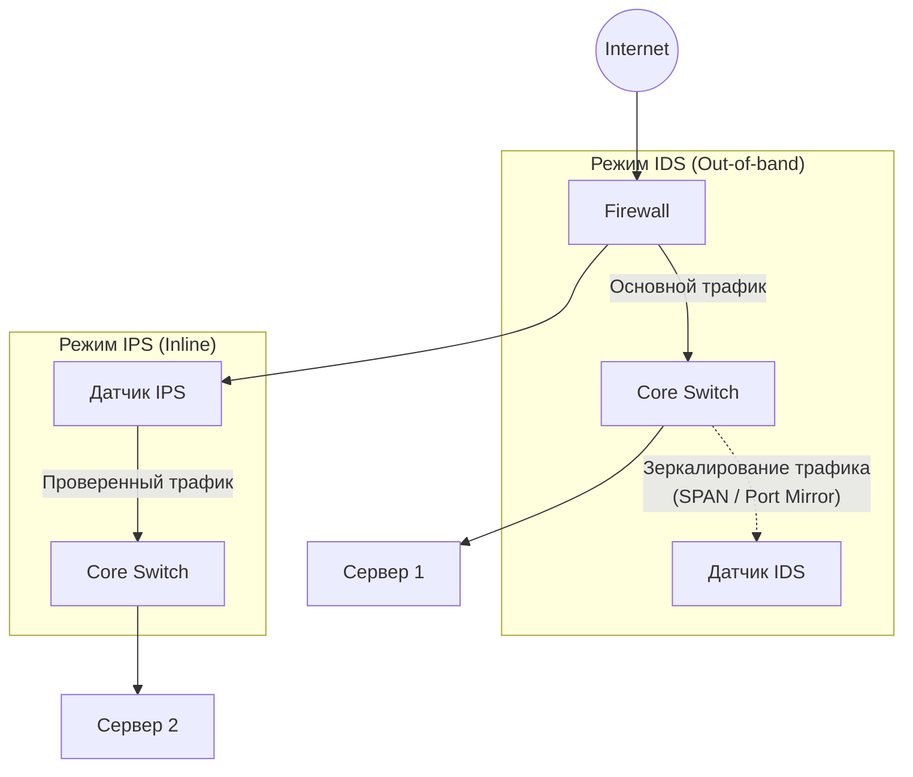

>[!info] Главная мысль  
**IDS (Intrusion Detection System)** — она смотрит на трафик, находит подозрительное и поднимает тревогу но сама система ничего не блокирует.
>
>**IPS (Intrusion Prevention System)** — она стоит прямо на пути трафика, находит подозрительное и физически не даёт ему пройти.

## Фундаментальные различия: IDS vs IPS

| Характеристика       | IDS (Обнаружение)                                                    | IPS (Предотвращение)                                                                |
| -------------------- | -------------------------------------------------------------------- | ----------------------------------------------------------------------------------- |
| **Роль**             | Пассивный наблюдатель                                                | Активный участник                                                                   |
| **Размещение**       | Out-of-band (вне основного пути трафика, через зеркальный порт/SPAN) | Inline (в разрыве канала, последовательно с трафиком)                               |
| **Реакция на атаку** | Генерирует предупреждение (лог, email, SNMP trap)                    | Блокирует пакет, сбрасывает TCP-сессию, банит IP                                    |
| **Влияние на сеть**  | Нулевое (не добавляет задержку, не может «уронить» сеть)             | Добавляет микросекунды задержки; при сбое или перегрузке может разорвать соединение |
| **Аналогия**         | Система видеонаблюдения в магазине                                   | Охранник на входе, который не пускает вора                                          |

> [!note] Эволюция  
> Сегодня граница между ними размыта. Большинство современных систем (например, Suricata или коммерческие NGFW) работают в режиме **IDPS**: по умолчанию они только мониторят (IDS), но при чётком совпадении с критической сигнатурой могут переключиться на блокировку (IPS).

## Как системы принимают решения: Методы обнаружения

Чтобы понять, является ли пакет «атакой», система использует один или несколько из трёх основных методов.

### Сигнатурный анализ (Signature-based)

Самый старый и распространённый метод. Работает как антивирус.

- **Как работает:** В базе хранятся тысячи правил (сигнатур).
- **Плюсы:** Очень высокая скорость, минимальное количество ложных срабатываний (False Positives), если правила написаны хорошо.
- **Минусы:** Абсолютно бесполезен против **Zero-day** атак (новых, неизвестных угроз), для которых ещё не написана сигнатура.

### Аномальный (поведенческий) анализ (Anomaly-based)

- **Как работает:** Система сначала изучает «нормальное» поведение сети в течение периода (например, сколько трафика обычно идёт на порт 443, какие протоколы используются). Затем она ищет отклонения от этой нормы.
- **Плюсы:** Может обнаружить новые, неизвестные атаки (Zero-day) и действия инсайдеров.
- **Минусы:** Огромное количество ложных срабатываний (False Positives). Любой легитимный скачок трафика (например, начало рабочей недели или обновление ОС) может быть расценен как атака.

### Эвристический анализ и анализ протоколов (Protocol Analysis)

- **Как работает:** Система знает, как _должен_ выглядеть правильный трафик согласно RFC. Она проверяет не содержимое, а структуру. Например, если в HTTP-заголовке длина поля указана как 100 байт, а реально передано 500, или если в пакете TCP флаги SYN и FIN установлены одновременно (что абсурдно с точки зрения протокола).
- **Плюсы:** Отлично ловит сканеры портов, фаззинг и попытки эксплуатации уязвимостей на уровне протокола.
- **Минусы:** Требует больших вычислительных ресурсов для глубокой разборки (Deep Packet Inspection, DPI) каждого пакета.

## Архитектура и точки внедрения

Где именно в сети должна стоять система? Это зависит от её типа.

### NIDS vs HIDS

- **NIDS (Network IDS):** Анализирует весь трафик, проходящий через сегмент сети. Ставится на границах (перед Firewall, после Firewall, в ядре ЦОД).
- **HIDS (Host IDS):** Агент, установленный непосредственно на сервер или рабочую станцию (например, OSSEC, Wazuh). Анализирует логи ОС, целостность файлов и локальный сетевой стек.

>[!important] Точка установки имеет значение
>- **До Firewall:** IDS увидит _весь_ мусор и сканирование из интернета. Полезно для оценки реального уровня угроз, но создаёт много шума.
>- **После Firewall:** IDS увидит только то, что Firewall уже пропустил. Меньше шума, выше шанс обнаружить целенаправленную атаку, которая обошла правила межсетевого экрана.

## Ключевые компоненты архитектуры IDS/IPS

Любая корпоративная система состоит из четырёх логических частей:

1. **Sensor (Датчик):** «Глаза и уши». Устройство или ПО, которое захватывает пакеты (через libpcap, DPDK, AF_PACKET) и проводит первичный анализ.
2. **Analyzer (Анализатор):** «Мозг». Сопоставляет захваченные данные с сигнатурами, эвристиками или моделями машинного обучения.
3. **Database (Хранилище):** База данных, куда записываются алерты, метаданные сессий и статистика.
4. **Management Console (Консоль управления):** Интерфейс для администратора. Позволяет просматривать алерты, обновлять правила, настраивать политики и генерировать отчёты.

## Популярные инструменты (Open Source и Commercial)

### Open Source (Золотой стандарт индустрии)

| Инструмент           | Особенности                                                                                                                                                                                              | Для чего лучше всего подходит                                     |
| -------------------- | -------------------------------------------------------------------------------------------------------------------------------------------------------------------------------------------------------- | ----------------------------------------------------------------- |
| **Snort**            | IDS система. Работает в однопоточном режиме (в классической версии).                                                                                                                                     | Классический сигнатурный анализ, обучение, небольшие сети.        |
| **Suricata**         | Современный наследник Snort. **Многопоточный**, поддерживает язык правил, совместимый с Snort, умеет извлекать файлы из трафика и поддерживает Lua-скрипты.                                              | Высоконагруженные сети, одновременная работа в режимах IDS и IPS. |
| **Zeek** (ранее Bro) | Это **не** классическая IDS. Это Network Security Monitor (NSM). Он не кричит «АТАКА!», он превращает сетевой трафик в структурированные логи (кто, куда, когда, какой протокол, какие TLS-сертификаты). | Глубокий анализ, построение поведенческих моделей.                |

> [!tip] Связка Suricata + Zeek  
> В современных SOC (Security Operations Center) их используют вместе: Suricata ищет известные атаки по сигнатурам, а Zeek собирает богатые метаданные для расследования инцидентов и поиска аномалий.

## Главные проблемы и ограничения на практике

Администратору важно понимать не только то, что система _может_, но и то, где она _бессильна_.

### Ложные срабатывания (False Positives) и пропуски (False Negatives)

- **False Positive:** Система заблокировала легитимный трафик (например, обновление 1С попало под сигнатуру вредоносного ПО). Бизнес встаёт, админа ругают.
- **False Negative:** Система пропустила реальную атаку. Это хуже, так как создаёт ложное чувство безопасности.
> _Баланс:_ Настройка IDS/IPS — это вечный поиск компромисса между безопасностью и доступностью.

### Шифрованный трафик (TLS/HTTPS)

Это **главный враг** современных IDS/IPS. Сегодня более 80% трафика зашифровано.

- Если трафик зашифрован, сигнатурный анализ видит только бессмысленный набор байт. Он может проверить только IP-адрес, порт и метаданные TLS (SNI, сертификат), но не содержимое HTTP-запроса.
- **Решение:** SSL/TLS Inspection (дешифрация трафика). Но это требует огромных вычислительных ресурсов и поднимает юридические/этические вопросы о приватности пользователей.

### Производительность (Performance)

- Режим **Inline (IPS)** требует проверки _каждого_ пакета в реальном времени. Если мощность датчика меньше скорости канала (например, 10 Гбит/с трафика на слабом сервере), пакеты начнут дропаться, что приведёт к разрыву легитимных соединений и деградации сети.
- Для высоких скоростей используются аппаратные ускорители (DPDK, FPGA, ASIC), а не стандартный стек ядра Linux.

### Уклонение от обнаружения (Evasion techniques)

Злоумышленники знают, как работают IDS. Они используют:

- Фрагментацию IP-пакетов (чтобы сигнатура, ищущая цельную строку, не сработала).
- Кодирование полезной нагрузки (URL-encoding, Base64).
- Использование нестандартных портов (например, HTTP на порту 8080 или 4444). Хорошая IPS умеет нормализовывать трафик (собирать фрагменты, декодировать) перед анализом, но это ещё больше бьёт по производительности.