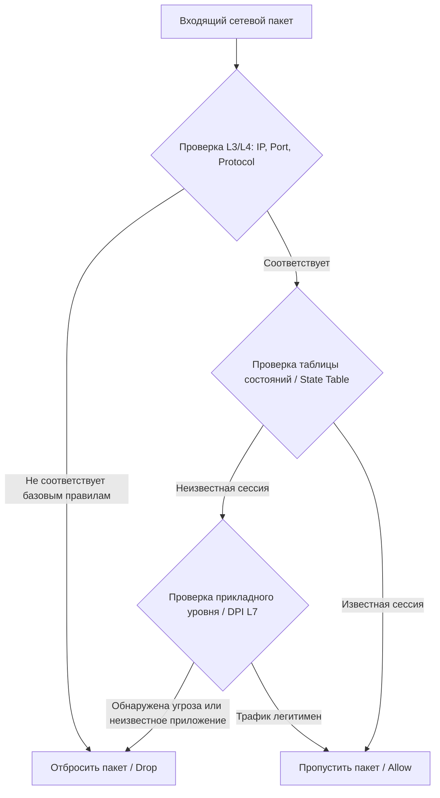
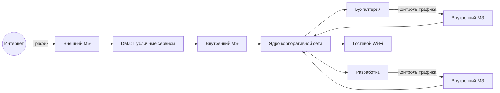

### Введение в теорию сетевой периметровой защиты

Межсетевые экраны (МЭ), также известные как фаерволы, представляют собой программные или аппаратно-программные комплексы, предназначенные для фильтрации сетевого трафика на основе заданных правил безопасности. В теоретической модели информационной безопасности корпоративной сети МЭ формируют базовый периметр защиты, разграничивая зоны с разным уровнем доверия: недоверенную внешнюю среду (Интернет) и внутреннюю корпоративную инфраструктуру.

Основная теоретическая задача фаервола заключается не в обнаружении сложных многоэтапных атак, а в строгом контроле потоков данных, обеспечении сокрытия внутренней топологии сети и блокировке неавторизованных сетевых сессий.

### Эволюция и теоретические механизмы фильтрации

Процесс обработки сетевого пакета межсетевым экраном базируется на многоуровневой модели OSI. В зависимости от глубины анализа, выделяются несколько теоретических поколений и механизмов фильтрации.

**1. Фильтрация пакетов (Packet Filtering)** Данный механизм работает на сетевом (L3) и транспортном (L4) уровнях модели OSI. Анализ осуществляется на основе заголовков пакетов: IP-адресов отправителя и получателя, номеров портов и протоколов. 
_Аналогия:_ Проверка конверта на почтовом сортировочном центре без вскрытия самого письма. Решения принимаются исключительно на основе видимых метаданных. Недостатком данного подхода является отсутствие понимания контекста сессии, что делает сеть уязвимой к спуфингу (подмене адресов) и не позволяет корректно обрабатывать динамические протоколы.

**2. Контроль состояния (Stateful Inspection)** Теория stateful inspection заключается в ведении таблицы состояний (state table), где хранится информация о всех активных сетевых сессиях. Межсетевой экран анализирует не только изолированный пакет, но и его принадлежность к установленному TCP/UDP-соединению. Если пакет является ответом на легитимный запрос из внутренней сети, он пропускается автоматически, без необходимости прописывания явных правил для обратного трафика.

**3. Глубокая инспекция пакетов (Deep Packet Inspection, DPI)** DPI переносит точку контроля на прикладной уровень (L7). Механизм анализирует не только заголовки, но и полезную нагрузку (payload) пакета, распознавая сигнатуры известных уязвимостей, вредоносного кода или специфических приложений. _Аналогия:_ Вскрытие конверта и чтение текста письма для проверки на наличие запрещенных слов или вложений.

### Архитектурные модели развертывания

Для обеспечения комплексной защиты теория сетевой безопасности предписывает использование эшелонированной обороны (Defense in Depth). Одиночный периметровый фаервол не способен обеспечить достаточный уровень безопасности из-за риска его компрометации или обхода.

**1. Зона DMZ (Demilitarized Zone)** DMZ представляет собой изолированный сетевой сегмент, размещаемый между внешним и внутренним межсетевыми экранами. В данной зоне публикуются сервисы, требующие доступа из Интернета (веб-серверы, почтовые шлюзы). Теоретическая модель DMZ гарантирует, что даже в случае компрометации публичного сервиса, злоумышленник столкнется со вторым барьером защиты перед доступом к внутренним ресурсам.

![[images (2).jpg|700]]

**2. Сегментация внутренней сети (Internal Segmentation)** Современная теория требует размещения фаерволов не только на периметре, но и внутри корпоративной сети. Внутренние МЭ ограничивают горизонтальное перемещение (lateral movement) злоумышленника. Сеть делится на микросегменты (например, сегменты для бухгалтерии, разработки, гостевого доступа), между которыми трафик строго регламентируется по принципу минимальных привилегий.

### Трансляция сетевых адресов (NAT) и сокрытие топологии

Важным теоретическим аспектом работы фаервола является реализация механизмов NAT (Network Address Translation). NAT позволяет множеству устройств внутри корпоративной сети использовать один или несколько публичных IP-адресов для выхода в Интернет.

С точки зрения безопасности, NAT реализует концепцию «безопасности через неясность» (security through obscurity). Внутренняя топология сети и реальные IP-адреса рабочих станций становятся невидимыми для внешних сканеров. Кроме того, NAT нарушает сквозную связность (end-to-end connectivity), что теоретически затрудняет инициацию входящих соединений извне, если они не были явно разрешены или не являются ответом на исходящий запрос.

### Межсетевые экраны нового поколения (NGFW)

Классические МЭ оперируют понятиями портов и IP-адресов. Однако современная теория сетевой защиты требует перехода к концепции NGFW (Next-Generation Firewall), которые интегрируют дополнительные аналитические модули:

1. **Идентификация приложений (Application Control):** NGFW способны распознавать конкретные приложения (например, отличать легитимный веб-трафик от трафика мессенджера, использующего порт 443) независимо от используемого порта. Это реализуется через анализ сигнатур прикладного уровня.
2. **Интеграция с каталогами пользователей:** Правила фильтрации привязываются не к IP-адресам, которые могут быть динамическими, а к учетным записям пользователей (например, из Active Directory). Это обеспечивает персонализацию политик безопасности.
3. **Интеграция с системами предотвращения вторжений (IPS):** Встроенный IPS-модуль анализирует трафик на наличие эксплойтов и сетевых аномалий в режиме реального времени, блокируя их до достижения целевого узла.
4. **Инспекция SSL/TLS трафика:** Поскольку большая часть интернет-трафика зашифрована, теория комплексной защиты требует обязательной расшифровки SSL/TLS сессий на фаерволе, проверки содержимого на наличие вредоносного кода и последующего обратного шифрования.

### Теоретические ограничения периметровой защиты

Несмотря на фундаментальную важность фаерволов, современная теория информационной безопасности признает концепцию «замка и рва» (perimeter-based security) устаревшей. Основные теоретические ограничения классического периметра включают:

- **Размывание периметра:** Использование облачных сервисов, мобильных устройств и удаленного доступа делает физический периметр сети неопределенным.
- **Внутренние угрозы:** Фаервол на границе сети бессилен против инсайдера или вредоносного ПО, уже попавшего внутрь периметра (например, через фишинг).
- **Зашифрованный трафик:** Даже при наличии SSL-инспекции, использование end-to-end шифрования (например, в некоторых мессенджерах) делает глубокий анализ трафика на периметре невозможным без нарушения криптографической стойкости.

В связи с этим, использование фаерволов в современной корпоративной сети рассматривается не как абсолютное решение, а как один из слоев в архитектуре нулевого доверия (Zero Trust Architecture). В парадигме Zero Trust фаерволы обеспечивают базовую сетевую сегментацию и контроль потоков данных, в то время как проверка доверия осуществляется непрерывно, на уровне каждого запроса к ресурсу, независимо от его источника.

---
## Контрольные вопросы для самопроверки

1. В чем заключается принципиальное теоретическое отличие механизма глубокой инспекции пакетов (DPI) от классической фильтрации пакетов (Packet Filtering)? На каких уровнях модели OSI они работают?

2. Какую роль играет зона DMZ (Demilitarized Zone) в модели эшелонированной обороны (Defense in Depth) и почему публичные сервисы (например, веб-серверы) размещают именно там, а не во внутренней сети?

3. Каким образом механизм трансляции сетевых адресов (NAT) способствует повышению безопасности корпоративной сети, помимо своей основной функции экономии публичных IP-адресов? Какую концепцию безопасности он реализует?

4. Назовите не менее трех ключевых функций межсетевых экранов нового поколения (NGFW), которые отличают их от классических фаерволов, оперирующих исключительно IP-адресами и номерами портов.

5. Почему классическая концепция периметровой защиты («замок и ров») считается недостаточной в современных условиях? Назовите три теоретических ограничения периметровых фаерволов и объясните, как парадигма Zero Trust (нулевого доверия) дополняет их работу.

---
## Ответы на вопросы

1. Классическая фильтрация пакетов работает на сетевом (L3) и транспортном (L4) уровнях модели OSI. Она анализирует исключительно заголовки пакетов (IP-адреса, номера портов, протоколы), не вскрывая их содержимое. Глубокая инспекция пакетов (DPI) переносит точку контроля на прикладной уровень (L7). Ее принципиальное отличие заключается в анализе не только заголовков, но и самой полезной нагрузки (payload) пакета. Это позволяет механизму распознавать сигнатуры известных уязвимостей, вредоносный код и специфические приложения, анализируя фактическое содержимое передаваемых данных.

2. Зона DMZ (Demilitarized Zone) представляет собой изолированный сетевой сегмент, расположенный между внешним и внутренним межсетевыми экранами. В ней размещаются публичные сервисы, которые должны быть доступны из Интернета. Теоретическая модель DMZ обеспечивает дополнительный барьер защиты: даже в случае успешной компрометации публичного сервиса, злоумышленник не получит прямого доступа к внутренним ресурсам корпоративной сети, так как ему придется преодолеть второй межсетевой экран.

3. Помимо экономии IP-адресов, NAT повышает безопасность за счет сокрытия внутренней топологии сети и реальных IP-адресов рабочих станций от внешних сканеров, реализуя концепцию «безопасности через неясность» (security through obscurity). Кроме того, NAT нарушает сквозную связность (end-to-end connectivity), что теоретически затрудняет инициацию входящих соединений извне, если они не являются ответом на легитимный исходящий запрос или не были явно разрешены правилами фаервола.

4. Межсетевые экраны нового поколения отличаются от классических фаерволов наличием следующих интегрированных функций (достаточно назвать три из перечисленных):
	1. **Идентификация приложений (Application Control):** распознавание конкретных приложений независимо от используемого порта.
	2. **Интеграция с каталогами пользователей:** привязка правил фильтрации к учетным записям пользователей (например, из Active Directory), а не только к динамическим IP-адресам.
	3. **Интеграция с системами предотвращения вторжений (IPS):** анализ трафика на наличие эксплойтов и сетевых аномалий в режиме реального времени.
	4. **Инспекция SSL/TLS трафика:** расшифровка защищенных сессий, проверка их содержимого на наличие угроз и последующее обратное шифрование.

5. Классическая концепция «замка и рва» считается недостаточной из-за трех основных теоретических ограничений периметровых фаерволов:
	1. **Размывание периметра:** использование облачных сервисов, мобильных устройств и удаленного доступа делает физическую границу сети неопределенной.
	2. **Внутренние угрозы:** периметровый фаервол бессилен против инсайдера или вредоносного ПО, которое уже попало внутрь периметра (например, через фишинг).
	3. **Зашифрованный трафик:** использование сквозного шифрования делает глубокий анализ трафика на периметре невозможным без нарушения криптографической стойкости.
