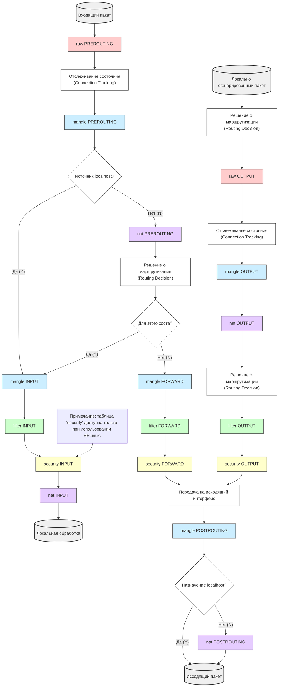
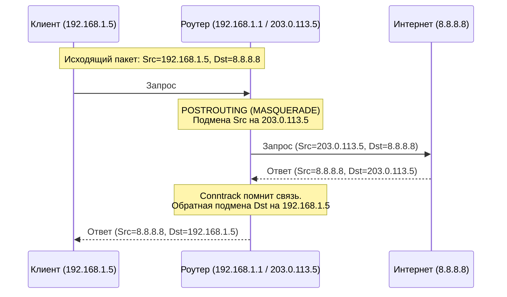

## 1. Что такое iptables и зачем он вообще нужен

**iptables** — это утилита которая позволяет администратору настраивать правила фильтрации пакетов в ядре Linux. Сам iptables **ничего не фильтрует** — он лишь пишет и читает правила в подсистему ядра под названием **Netfilter**. Это важно понимать сразу: iptables — это "пульт управления", а реальная работа происходит внутри ядра, на уровне сетевого стека, ещё до того, как пакет доберётся до приложения.

**Аналогия**. Представь себе почтовое отделение внутри здания. Каждое письмо (пакет), которое приходит, уходит или проходит транзитом, обязано пройти через один из нескольких контрольных пунктов (цепочек). На каждом контрольном пункте стоит охранник со списком инструкций (правил): "если письмо от такого-то адресата — отклонить", "если письмо на 80 порт — пропустить", "если письмо часть уже начатой переписки — пропустить не глядя".

### Какую проблему решает iptables

До появления таких механизмов фильтрация трафика на хосте либо отсутствовала вовсе, либо реализовывалась на уровне приложений (каждый сервис сам решал, кого пускать). Это создавало несколько проблем:

- **Нет единой точки контроля** — каждое приложение реализует безопасность по-своему, где-то криво, где-то никак.
- **Нет защиты на уровне ядра** — вредоносный пакет успевает потратить ресурсы CPU/памяти прежде, чем приложение его отклонит.
- **Невозможно перенаправлять или изменять трафик** (NAT, проброс портов) без сложных самописных решений.

iptables решает это, добавляя **централизованную, декларативную, высокопроизводительную фильтрацию на уровне ядра**, до того как пакет попадёт в TCP/IP стек приложения. Это классический **host-based firewall** (хостовый экран) в противовес network-based (аппаратные/периметровые файрволы типа Cisco ASA, pfSense-роутеров и т.д.) — он защищает именно эту машину, а не сеть целиком.

## 2. Архитектура: Netfilter и iptables

Часто говорят "настроить iptables", но технически это не совсем верно.

- **Netfilter** — это фреймворк внутри ядра Linux, набор хуков (точек перехвата), через которые проходит каждый сетевой пакет.
- **iptables** — это утилита пользовательского пространства (интерфейс), которая позволяет администратору писать правила для Netfilter.

### Аналогия: Таможня и Склад

Представьте, что ваш сервер — это закрытый город.

- **Netfilter** — это сама система КПП, дорог и шлагбаумов, встроенная в ландшафт (ядро).
- **iptables** — это главный таможенник с планшетом, который расставляет посты, пишет инструкции для охранников и решает, кого пускать.
- **Пакет (Packet)** — это грузовик с товаром, который едет по дорогам.

> [!important] Главное правило
> Пакеты не "задерживаются" в iptables. Они проходят сквозь него со скоростью обработки ядром.

### Архитектура Iptables

Iptables состоит из 5 таблиц. Каждая таблица имеет свой список цепочек. В цепочках записываются правила, которые применяются к пакету. У каждого правила есть **условие** или несколько **условий** при котором срабатывает какое-то **действие**. Получается такая иерархия:

* Таблица 1
	* Цепочка 1
	* Цепочка 2
		* Правило 1
		* Правило 2
		* Правило 3
			* Условие 1
			* Условие 2
			* Действие

## 3. Таблицы (tables)

Таблица — это набор цепочек, сгруппированных **по назначению**. Каждая таблица отвечает за свою функцию, и правила в ней обрабатываются в определённом порядке относительно других таблиц. iptables структурно состоит из **5 таблиц**, в которые входят **цепочки**, в свою очередь содержащие наборы **правил**. 

Чтобы понять, зачем нужно несколько таблиц, нужно понять, **как пакет путешествует внутри Linux**. Когда сетевая карта получает байты, ядро собирает из них пакет и задает себе один фундаментальный вопрос: **"Кому этот пакет предназначен?"**

Возможны три сценария:

1. **INPUT**: Пакет адресован самому этому серверу (например, кто-то подключается к вашему серверу через SSH).
2. **OUTPUT**: Ваш сервер сам генерирует пакет и отправляет его в сеть (например, `apt update`).
3. **FORWARD**: Пакет прилетел на этот сервер, но предназначен для другой машины, а ваш сервер работает как роутер/шлюз.

Следует помнить, что верхний уровень иерархии составляют именно таблицы, каждая из которых предназначена для своей цели. Всего имеется пять таблиц

- **filter** - применяется, собственно, для фильтрации пакетов, является таблицей по умолчанию, т.е. если таблица не указана явно, то используется filter, имеет цепочки INPUT, FORWARD и OUTPUT.
- **nat** - предназначен для преобразования адресов и портов источника и назначения пакетов, встроенные цепочки: PREROUTING, OUTPUT, POSTROUTING.
- **mangle** - используется для модификации некоторых заголовков (TTL, TOS) и маркировке пакетов и соединений, содержит цепочки PREROUTING, INPUT, FORWARD, OUTPUT и POSTROUTING.
- **raw** - предназначена для обработки пакетов прежде, чем они будут переданы системе conntrack, которая занимается отслеживанием состояния соединений и принадлежностью пакетов этим соединениям. Содержит встроенные цепочки PREROUTING и OUTPUT.
- **security** - используется для работы совместно с системами принудительного контроля доступа, такими как SELinux. Встроенные цепочки INPUT, FORWARD, OUTPUT.

На практике вы обычно будете использовать таблицы **filter** и **nat**, в некоторых случаях - **mangle**, поэтому таблицы **raw** и **security** мы далее рассматривать не будем.

>[!WARNING] Важно!
>Обратите внимание, что названия таблиц всегда пишутся в **нижнем** регистре, а цепочек - в **ВЕРХНЕМ**.

## 4. Цепочки (chains)

Цепочка — это список правил, привязанный к конкретной точке в пути пакета. Есть 5 встроенных цепочек, и администратор может создавать свои собственные для организации структуры правил.

| Цепочка         | Когда срабатывает                                                            |
| --------------- | ---------------------------------------------------------------------------- |
| **PREROUTING**  | Пакет только что пришёл на интерфейс, решение о маршрутизации ещё не принято |
| **INPUT**       | Пакет предназначен для нашего firewall-а (локальный процесс)                 |
| **FORWARD**     | Пакет транзитный — идёт через наш firewall дальше (маршрутизатор/роутер)     |
| **OUTPUT**      | Пакет сгенерирован firewall-ом на этом хосте (например ping, apt update)     |
| **POSTROUTING** | Пакет уже промаршрутизирован и готов покинуть интерфейс                      |
>[!WARNING] Важно!
>Не каждая цепочка доступна в каждой таблице

![[iptables-basics-1-001.avif]]

После инициализации все цепочки пустые и не содержат никаких правил. Но каждая цепочка имеет действие по умолчанию (стандартно - ACCEPT), которое будет применено к пакету, если он прошел всю цепочку и не попал под действие ни одного правила.

>[!danger] Критично
>Действие `ACCEPT` в цепочке **НЕ пропускает** пакет через последующие цепочки (`INPUT`, `FORWARD`, `OUTPUT`). Действие `ACCEPT` означает лишь: **"Прекратить обработку в этой таблице и передать пакет дальше по конвейеру ядра"**.

## 5. Правила (rules)

Задача администратора - наполнить цепочки правилами. Каждое правило состоит из трех составляющих: **условие**, **действие** и **счетчик**. Если пакет удовлетворяет условиям правила, то к нему применяется действие и счетчик меняется.

### Счетчики

**Счетчик в iptables** — это встроенный в каждое правило элемент, который автоматически считает количество прошедших через него сетевых пакетов и их суммарный объем в байтах. При создании любого правила в `iptables` ядро Linux автоматически добавляет к нему два счетчика:

1. **ПКМ (packets)** — число пакетов, которые подошли под условия данного правила.
2. **Байты (bytes)** — общий размер этих пакетов в байтах.

Когда через сетевой интерфейс проходит пакет, `iptables` проверяет его по цепочке правил. Если пакет соответствует критериям правила, его счетчики увеличиваются на единицу (для пакетов) и на размер файла/пакета в байтах

**Зачем нужны счетчики**
- **Анализ трафика и мониторинг:** Позволяют узнать, сколько данных генерирует конкретный IP-адрес, порт или сервис.
- **Диагностика:** Помогают понять, срабатывает ли вообще созданное вами правило (если значения счетчиков равны нулю, значит, трафик по этому критерию не идет).
- **Ограничение трафика (Rate Limiting):** В связке с модулем `recent` или `hashlimit` счетчики помогают защищаться от DDoS-атак и брутфорса.

### Структура правила

Правило состоит из двух частей:
1. **Условие (Match)**: Каким условиям должен соответствовать пакет? (IP, порт, протокол, интерфейс).
2. **Действие (Target/Jump)**: Что с ним сделать, если он подходит под критерий?

У одного правила может быть несколько **условий**, они комбинируются по принципу логического И, допускается также условие с отрицанием. Таким образом правило сработает если пакет удовлетворяет **всем** перечисленным условиям. 

В качестве условий могу выступать различные свойства пакетов и/или соединений, наиболее часто используются интерфейсы, IP-адреса источника и назначения, а также порты.

Действие выполняет какую-либо одну операцию с пакетом, разные таблицы допускают применение разных наборов действий.

- `ACCEPT` — пропустить пакет (дать добро).
- `DROP` — молча уничтожить пакет. Отправитель будет ждать ответа, пока не истечет таймаут (стучать в закрытую дверь).
- `REJECT` — уничтожить пакет, но отправить отправителю ICMP-сообщение "Destination Unreachable" (вежливо отказать).
- `LOG` — записать информацию о пакете в системный журнал (syslog/journald) и передать следующему правилу.
- `RETURN` — прекратить обход текущей пользовательской цепочки и вернуться в родительскую.

Наиболее общими действиями являются **ACCEPT**, **DROP** и **REJECT**. Первое из них пропускает пакет, а два последних блокируют, при этом **REJECT** сообщает источнику об отказе, а **DROP** нет, поэтому его чаще всего используют для блокировки внешних пакетов, чтобы не давать потенциальному злоумышленнику лишней информации о работе сети.

## 6. Синтаксис и базовые команды

Общий формат команды: 

`iptables -t [таблица] -[команда] [цепочка] [условия] -j [цель]`

Если флаг `-t` не указан, по умолчанию используется таблица `filter`.

### Основные команды управления цепочками:

- `-A` (Append) — добавить правило в конец цепочки.
- `-I` (Insert) — вставить правило в начало (или по номеру `-I INPUT 3`).
- `-D` (Delete) — удалить правило (по номеру или по полному совпадению текста).
- `-L` (List) — вывести список правил.
- `-F` (Flush) — очистить все правила в цепочке (или во всех, если цепочка не указана).
- `-P` (Policy) — задать политику по умолчанию для встроенной цепочки (`ACCEPT` или `DROP`).
- `-R` (Replace) — замена правила на другое не меняя его нумерации.

Чтобы удалять или вставлять правила точно в нужное место, нужно видеть их нумерацию:

```bash
iptables -L INPUT --line-numbers -n -v
```

Вывод будет выглядеть так:

```bash
num  pkts bytes target     prot opt in     out     source               destination
1       0     0 ACCEPT     all  --  lo     *       0.0.0.0/0            0.0.0.0/0
2      10  1200 ACCEPT     tcp  --  *      *       0.0.0.0/0            0.0.0.0/0            tcp dpt:22
3       5   400 DROP       all  --  *      *       192.168.1.100        0.0.0.0/0
```

### Условия (Matches):

- `-s` / `-d` — IP-адрес источника / назначения (можно с маской `/24`).
- `-p` — протокол (`tcp`, `udp`, `icmp`).
- `--sport` / `--dport` — порт источника / назначения (требует указания `-p tcp` или `-p udp`).
- `-i` / `-o` — входящий / исходящий сетевой интерфейс (`eth0`, `lo`).
- `!` — инверсия (например, `! -s 192.168.1.1` — все, кроме этого IP).

### Примеры с пояснениями:

```bash
# Разрешить входящие подключения к нашему SSH (порт 22)
iptables -A INPUT -p tcp --dport 22 -j ACCEPT

# Заблокировать доступ с конкретного IP
iptables -A INPUT -s 192.168.1.100 -j DROP

# Запретить пинги (ICMP) от нашей сети наружу
iptables -A OUTPUT -s 10.0.0.0/24 -p icmp -j DROP

# Вставка правила в самое начало
iptables -I INPUT 1 -s 10.0.0.5 -j ACCEPT

# Вставка перед третьей строкой (станет новой строкой 3, а старая 3 сдвинется на 4):
iptables -I INPUT 3 -p tcp --dport 8080 -j ACCEPT

# Удаление правила по номеру
iptables -D INPUT 3

# Удаление по полному совпадению
iptables -D INPUT -s 192.168.1.100 -j DROP # Найдет точное совпадение и удалит его. Удобно, если ты не хочешь считать строки

# Замена правила
iptables -R INPUT 3 -s 192.168.1.200 -j DROP
```

>[!danger] Порядок правил имеет значение:
>Если добавить правило `DROP all` первым, а потом `ACCEPT SSH`, то SSH работать не будет. В iptables нет "приоритета", есть только порядок сверху вниз.

>[!danger] Loopback интерфейс (`lo`):
>Многие забывают разрешить трафик на локальной петле. Если заблокировать всё подряд, могут отвалиться локальные сервисы (например, PHP-FPM общается с Nginx через localhost, или PostgreSQL слушает 127.0.0.1).
>_Правило:_ `iptables -A INPUT -i lo -j ACCEPT`.

Полное отключение ICMP не всегда оправдано, но системные администраторы идут на этот шаг по нескольким ключевым причинам:

1. Скрытие от сканеров (Защита от разведки)
	- **Принцип:** Хакеры и автоматизированные боты сканируют диапазоны IP-адресов, чтобы найти активные устройства.
	- **Результат:** Если устройство не отвечает на пинг, для сканера оно выглядит как «выключенное» или несуществующее. Это снижает вероятность того, что сеть выберут в качестве цели для целенаправленной атаки.

2. Защита от DoS/DDoS-атак
	- **Ping Flood (IP-флуд):** Злоумышленник может направить на устройство огромный поток пинг-запросов. Сервер будет тратить ресурсы процессора и пропускную способность канала на генерацию ответов (Echo Reply), что может привести к отказу в обслуживании.
	- **Smurf-атака:** Устаревший, но все еще учитываемый вид атаки, когда пинг отправляется на широковещательный адрес от имени жертвы, и сотни компьютеров начинают одновременно отвечать пострадавшему серверу.

3. Уязвимости в реализации протокола
	- **Пинг смерти (Ping of Death):** Историческая, но важная уязвимость, когда отправка деформированного или слишком большого пакета ICMP вызывала зависание или синий экран (BSOD) на принимающем устройстве.
	- **Современные баги:** Администраторы предпочитают перестраховаться и закрыть протокол, чтобы защититься от еще не обнаруженных уязвимостей (0-day) в сетевом стеке операционных систем.

Слепое отключение **всех** ICMP-пакетов вместо выборочной блокировки часто создает проблемы для самой сети:

- **Сложность диагностики:** Сетевые инженеры теряют базовый инструмент проверки доступности узлов (`ping`) и трассировки маршрута (`traceroute`).
- **Проблемы с размером пакетов (MTU):** Вместе с обычным пингом часто блокируют пакеты _ICMP Type 3 Code 4 (Destination Unreachable / Fragmentation Needed)_. Это ломает механизм **PMTUD** (Path MTU Discovery). В результате некоторые сайты или сервисы у легитимных пользователей могут просто перестать открываться или будут бесконечно загружаться.

**Как делают правильно:** Вместо полного отключения на хороших файрволах настраивают **Rate Limiting** (ограничение количества ответов в секунду) или разрешают пинги только из доверенной внутренней сети (LAN) для мониторинга, полностью закрывая их снаружи (из WAN).

## 7. Политики по-умолчанию

Все действия делятся на две категории: **терминальные** и **нетерминальные**. 
* **Терминальные** действия прекращают прохождение пакета по цепочке, к ним относятся все специфичные действия для таблиц **filter** и **nat**.
* **Нетерминальными** являются действия специфичные для таблицы **mangle**.

Попав в цепочку пакет последовательно проходит правила **в порядке их перечисления** (сверху вниз) до первого срабатывания. Дальнейшее его движение зависит от типа действия, если действие нетерминальное - пакет продолжит движение по цепочке, иначе - покидает ее.

![[iptables-basics-1-003.avif]]

Правила в цепочке читаются **строго сверху вниз, по порядку**. Как только пакет совпал с условием правила, применяется действие, и дальнейший поиск прекращается (если цель не `LOG`).

>[!danger] Как заблокировать самого себя
>Если вы удалите все правила и поставите политику по умолчанию `DROP`, вы потеряете доступ к серверу по SSH. И вам придется пойти физически к серверу и подключится через консольный порт.

## 8. Инспекция состояний (Stateful Inspection)

В старых («глупых») фаерволах каждое правило смотрело на пакет изолированно. Если ты разрешил входящий трафик на порт 80, тебе приходилось вручную разрешать исходящий трафик с порта 80, иначе ответ не уходил бы клиенту.

**Stateful Inspection (Инспекция состояний)** меняет подход. Ядро Linux помнит **контекст** соединения. Оно знает, что этот входящий пакет — не новая атака, а просто ответ на твой легитимный запрос.

#### Как это работает (Conntrack)

В ядре есть модуль `nf_conntrack`. Он ведет таблицу активных соединений. Когда проходит первый пакет, ядро создает запись в этой таблице. Все последующие пакеты этого же соединения сверяются с этой записью.

#### Ключевые состояния (States)
##### NEW

Первый пакет нового соединения. _Пример:_ Ты набираешь адрес сайта в браузере и жмешь Enter.

##### ESTABLISHED

Соединение уже установлено, идет обмен данными. _Пример:_ Сайт грузится, ты скроллишь страницу.

![[ChatGPT Image 28 сент. 2026 г., 09_41_10.png]]
##### RELATED

Пакет связан с существующим соединением, но является новым потоком. _Пример:_ FTP-сервер открывает второй канал для передачи файла поверх уже открытого управляющего соединения.

![[ChatGPT Image 28 сент. 2026 г., 09_43_06.png]]
##### INVALID

Пакет не соответствует ни одному известному состоянию (поврежден или подозрителен). _Пример:_ Попытка сканирования портов или сетевой сбой.

![[ChatGPT Image 28 сент. 2026 г., 09_44_17.png]]

#### Почему это спасает администратора?

Без stateful-правил тебе пришлось бы писать сотни правил для каждого сервиса. С ним достаточно одного «золотого» правила:

```bash
# Разрешить весь трафик, который является частью уже начатого нами диалога
iptables -A INPUT -m conntrack --ctstate ESTABLISHED,RELATED -j ACCEPT
```

**Без состояний (Stateless):** Тебе нужно разрешить не только вход на порты сервисов, но и выход ответов от них.

1. `INPUT -p tcp --dport 22 -j ACCEPT`
2. `OUTPUT -p tcp --sport 22 -j ACCEPT` (чтобы SSH мог ответить)
3. `INPUT -p tcp --dport 80 -j ACCEPT`
4. `OUTPUT -p tcp --sport 80 -j ACCEPT` (чтобы Nginx мог отдать страницу) ...и так для каждого сервиса и каждого протокола. Правил становится очень много, и в них легко запутаться.

**С состояниями (Stateful):** Ты пишешь одно универсальное правило в самом начале цепочки `INPUT`: `iptables -A INPUT -m conntrack --ctstate ESTABLISHED,RELATED -j ACCEPT`

Теперь тебе нужно добавить правила **только** для инициации новых подключений (`NEW`):

1. `iptables -A INPUT -p tcp --dport 22 -j ACCEPT`
2. `iptables -A INPUT -p tcp --dport 80 -j ACCEPT`

Все ответы сервера (исходящие) и все входящие ответы на твои запросы (например, когда сервер сам качает обновления) пройдут через «золотое правило».

**Что это дает:**

1. Можно смело блокировать все входящие (`-P INPUT DROP`).
2. При этом любые исходящие запросы (например, `apt update` или запрос к API) будут работать, потому что ответы от внешних серверов придут со статусом `ESTABLISHED` и пройдут через это правило.
3. Тебе не нужно открывать диапазон высокоуровневых портов (1024-65535) для ответов.

## 9. Модули расширений (-m)

iptables изначально знает только IP-адреса. Чтобы фильтровать по MAC, состояниям, лимитам или времени, используются модули. Они вызываются флагом `-m имя_модуля`.

- `-m mac --mac-source XX:XX:XX:XX:XX:XX` (только для INPUT/PREROUTING).
- `-m multiport --dports 22,80,443` (экономит место, чтобы не писать 3 правила).
- `-m time --timestart 08:00 --timestop 18:00 --days Mon,Tue,Wed,Thu,Fri` (доступ только в рабочие часы).
- `-m limit` (для ограничения скорости, подробнее в отдельной лекции).
- `-m state` или `-m conntrack` (основа Stateful Inspection).

Пример с multiport:

```bash
iptables -A INPUT -p tcp -m multiport --dports 80,443,8080 -j ACCEPT
```

## 10. Полная схема движения пакета




## 11. Пользовательские цепочки (Custom Chains)

Когда правил становится больше 50, и они в одной цепочке `INPUT` то поддерживать такие правила становится очень сложно. Можно создавать свои "папки" в глобальных цепочках и перенаправлять трафик в них.

```bash
# Создаем цепочку для защиты от сканеров
iptables -N ANTI_SCAN

# Добавляем в нее правила
iptables -A ANTI_SCAN -p tcp --tcp-flags ALL NONE -j DROP
iptables -A ANTI_SCAN -p tcp --tcp-flags ALL ALL -j DROP

# Перенаправляем весь входящий TCP трафик в нашу цепочку
iptables -A INPUT -p tcp -j ANTI_SCAN
```

**Как это работает:** Пакет попадает в `INPUT`, видит прыжок (`-j`) в `ANTI_SCAN`. Он идет туда, пробегает по правилам `ANTI_SCAN`.

- Если он там `DROP`нулся — всё, пакет мертв.
- Если он прошел все правила `ANTI_SCAN` и ни одно не сработало, он **возвращается** в `INPUT` и продолжает проверяться по следующим правилам после точки вызова `ANTI_SCAN`.

## 12. NAT (Network Address Translation)

Таблица `nat` используется для подмены адресов. Она работает **только** с первым пакетом нового соединения (далее ядро само помнит, что нужно подменять для этой сессии).

### 12.1. DNAT (Destination NAT) — Проброс портов

Изменяет адрес **назначения**. Используется в цепочках `PREROUTING` (до решения о маршрутизации). _Аналогия:_ Вы отправили письмо на адрес главного офиса, но секретарь на входе (PREROUTING) переклеил конверт и отправил его в конкретный отдел.

**Задача:** У нас есть сервер с белым IP `203.0.113.5`. Мы хотим, чтобы при обращении на его 80-й порт, трафик улетал на внутренний веб-сервер `192.168.1.10:8080`.

```bash
# 1. Меняем адрес назначения
iptables -t nat -A PREROUTING -d 203.0.113.5 -p tcp --dport 80 -j DNAT --to-destination 192.168.1.10:8080

# 2. ОБЯЗАТЕЛЬНО разрешаем этот транзитный трафик в таблице filter!
iptables -A FORWARD -d 192.168.1.10 -p tcp --dport 8080 -j ACCEPT
```

>[!warning] Важно про Forwarding
>Чтобы сервер вообще мог передавать чужие пакеты, в ядре должен быть включен форвардинг: `sysctl -w net.ipv4.ip_forward=1`

### 12.2. SNAT (Source NAT) — Маскарад

Изменяет адрес **источника**. Используется в цепочке `POSTROUTING` (когда решение о маршрутизации уже принято и пакет готов улететь). _Аналогия:_ Все сотрудники вашего офиса выходят в интернет. Внешний мир видит только один IP-адрес офиса, а не личные адреса каждого сотрудника.

**SNAT** применяется, когда у шлюза **статический** внешний IP.

```bash
iptables -t nat -A POSTROUTING -s 192.168.1.0/24 -o eth0 -j SNAT --to-source 203.0.113.5
```

**MASQUERADE** — разновидность SNAT, но применяется, когда внешний IP **динамический** (выдается провайдером, PPPoE, DHCP). Ядро само каждый раз подставляет актуальный IP интерфейса.

```bash
iptables -t nat -A POSTROUTING -s 192.168.1.0/24 -o ppp0 -j MASQUERADE
```

### Схема работы NAT



## 13. Сохранение и восстановление правил

iptables хранит правила **в оперативной памяти**. После перезагрузки сервера они исчезнут.

### Способ 1: iptables-persistent (Debian/Ubuntu)

```bash
sudo apt install iptables-persistent
# При установке спросит, сохранить ли текущие правила.
# Вручную сохранить:
sudo netfilter-persistent save
```

Правила лежат в `/etc/iptables/rules.v4`.

### Способ 2: iptables-save / iptables-restore (Универсальный)

```bash
# Экспорт в файл
iptables-save > /etc/my_firewall.rules

# Импорт из файла
iptables-restore < /etc/my_firewall.rules
```

Для автозагрузки можно добавить `iptables-restore` в `rc.local` или создать systemd-сервис.

## 14. Отладка и просмотр статистики

Команда `iptables -L -n -v` — ваш лучший друг.

- `-n` — не пытаться резолвить IP-адреса в доменные имена (работает мгновенно, без зависаний).
- `-v` — показать счетчики пакетов (pkts) и байт, а также интерфейсы.
- `--line-numbers` — показать номера строк (удобно для удаления через `iptables -D INPUT 3`).

_Здесь видно, что политика по умолчанию DROP уже отбила 10 пакетов, а SSH принял 200._

Чтобы сбросить счетчики (например, после тестов):

```bash
iptables -Z
```

---
## Контрольные вопросы

1. В чем заключается фундаментальная разница между утилитой `iptables` и подсистемой ядра `Netfilter`?
2. Назовите три сценария назначения пакета, которые определяет ядро Linux при получении байтов от сетевой карты.
3. Почему действие `ACCEPT` в цепочке не гарантирует, что пакет будет пропущен до конечного приложения? Что оно означает на самом деле?
4. В чем практическая разница между действиями `DROP` и `REJECT` с точки зрения отправителя пакета?
5. Какая таблица iptables используется по умолчанию, если флаг `-t` не указан явно?
6. В какой цепочке и в какой таблице необходимо применять правило для изменения адреса назначения (DNAT) при пробросе портов?
7. Почему для динамического внешнего IP-адреса (PPPoE/DHCP) рекомендуется использовать цель `MASQUERADE` вместо `SNAT`?
8. Что произойдет с пакетом, который прошел все правила в пользовательской цепочке (Custom Chain), но ни одно из них не сработало (не было терминального действия)?
9. Зачем нужен флаг `-n` при выполнении команды `iptables -L` и какие проблемы он предотвращает?
10. Где хранятся правила iptables после выполнения команды `iptables-save` и исчезнут ли они после перезагрузки сервера без дополнительной настройки сохранения?
---
## Ответы

1. **Разница iptables и Netfilter:** `Netfilter` — это фреймворк внутри ядра Linux (точки перехвата/хуки), который реально обрабатывает пакеты. `iptables` — это утилита пользовательского пространства, которая лишь передает инструкции (правила) для этого фреймворка.
2. **Три сценария назначения пакета:**
    - **INPUT**: Пакет предназначен самому серверу (локальному процессу).
    - **OUTPUT**: Пакет сгенерирован самим сервером.
    - **FORWARD**: Пакет транзитный, проходит через сервер к другой машине (роутинг).
3. **Смысл ACCEPT:** Это не «пропуск до приложения», а прекращение обработки правил в _текущей таблице/цепочке_. Пакет передается дальше по конвейеру ядра, где он может попасть под правила других таблиц или цепочек.
4. **DROP vs REJECT:** `DROP` молча уничтожает пакет (отправитель ждет таймаута), что скрывает наличие хоста. `REJECT` отправляет ICMP-сообщение об ошибке, вежливо сообщая, что доступ запрещен.
5. **Таблица по умолчанию:** Таблица `filter`.
6. **Цепочка для DNAT:** Цепочка `PREROUTING` в таблице `nat`.
7. **MASQUERADE vs SNAT:** `MASQUERADE` автоматически подставляет текущий IP интерфейса, что критично при динамическом IP (PPPoE/DHCP), когда внешний адрес может меняться. `SNAT` требует жестко прописанного статического IP.
8. **Поведение в Custom Chain:** Если пакет прошел всю пользовательскую цепочку и не попал под терминальное действие, он **возвращается** в родительскую цепочку и продолжает проверку со следующего после вызова правила.
9. **Флаг -n:** Отключает обратное DNS-резолвинг IP-адресов. Это ускоряет вывод команды в сотни раз и предотвращает зависания, если DNS-сервер недоступен.
10. **Хранение правил:** По умолчанию правила живут только в оперативной памяти (RAM). Без использования `iptables-persistent` или скриптов автозагрузки они исчезнут после перезагрузки.