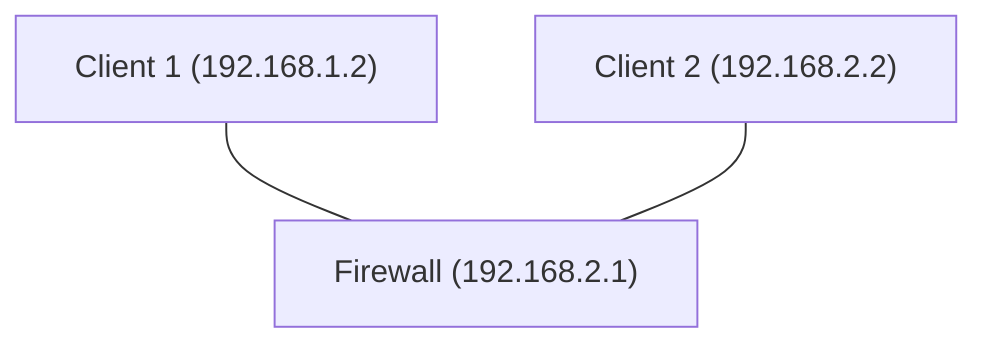

## Цель работы

Изучить архитектуру Netfilter/iptables, освоить базовую фильтрацию пакетов, stateful inspection, NAT, пользовательские цепочки и сохранение правил. На практике собрать стенд из трёх виртуальных машин, где один хост выполняет роль firewall/маршрутизатора между двумя другими хостами.

## Необходимое ПО и ресурсы

- 3 виртуальные машины на базе Linux (Ubuntu Server 22.04/24.04 или Debian 12).
- Два изолированных Linux-моста в Proxmox
- Утилиты в ВМ: `iptables`, `net-tools`, `tcpdump`, `curl`, `openssh-server`.

## Топология

