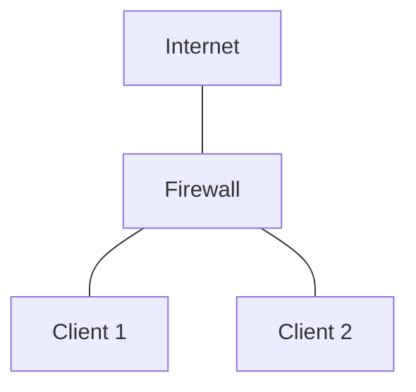

## Цель работы

Изучить архитектуру Netfilter/iptables, освоить базовую фильтрацию пакетов, stateful inspection, NAT, пользовательские цепочки и сохранение правил. На практике собрать стенд из трёх виртуальных машин, где один хост выполняет роль firewall/маршрутизатора между двумя другими хостами.

## Необходимое ПО и ресурсы

- 3 виртуальные машины на базе Linux (Ubuntu Server 24.04).
- Два изолированных Linux-моста в Proxmox
- Утилиты в ВМ: `iptables`, `openssh-server`, `iptables-persistent`.

## Топология сети

| Узел     | IP-адрес         | Шлюз        | Мост             | Описание соединения    |
| -------- | ---------------- | ----------- | ---------------- | ---------------------- |
| Firewall | DHCP             | DHCP        | vmbr0            | Firewall <--> INTERNET |
| Firewall | 192.168.1.1      | —           | vmbrC1.23.41-0-1 | Firewall <--> Client 1 |
| Firewall | 192.168.2.1      | —           | vmbrC1.23.41-0-2 | Firewall <--> Client 2 |
| Client 1 | 10.10.10.10/24   | 10.10.10.1  | vmbrC1.23.41-0-1 | Client 1 <--> Firewall |
| Client 2 | 192.168.1.100/24 | 192.168.1.1 | vmbrC1.23.41-0-2 | Client 2 <--> Firewall |

## Задачи на практическую работу

1. Развернуть на `Client 1` и `Client 2` openssh серверы
2. 