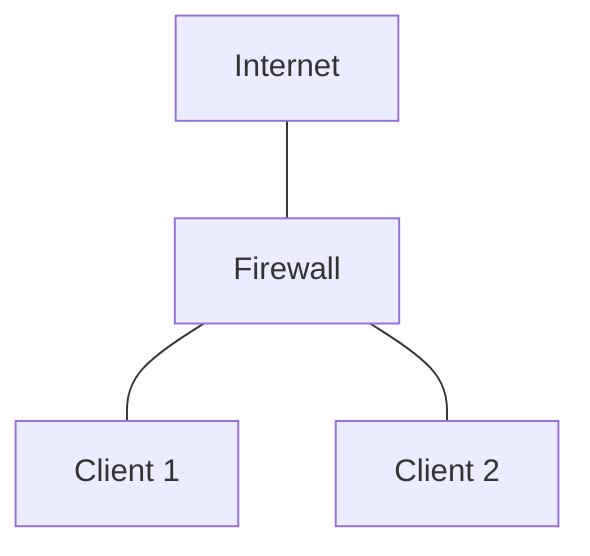

## Цель работы

Изучить архитектуру Netfilter/iptables, освоить базовую фильтрацию пакетов, stateful inspection, NAT, пользовательские цепочки и сохранение правил. На практике собрать стенд из трёх виртуальных машин, где один хост выполняет роль firewall/маршрутизатора между двумя другими хостами.

## Необходимое ПО и ресурсы

- 3 виртуальные машины на базе Ubuntu Server 24.04.
- Два изолированных Linux-моста в Proxmox
- Утилиты в ВМ: `iptables`, `openssh-server`, `iptables-persistent`.

## Топология сети

| Узел     | IP-адрес         | Шлюз        | Мост             | Описание соединения |
| -------- | ---------------- | ----------- | ---------------- | ------------------- |
| Firewall | DHCP             | DHCP        | vmbr0            | Firewall ↔ INTERNET |
| Firewall | 10.10.10.1/24    | —           | vmbrC1.23.41-0-1 | Firewall ↔ Client 1 |
| Firewall | 192.168.2.1/24   | —           | vmbrC1.23.41-0-2 | Firewall ↔ Client 2 |
| Client 1 | 10.10.10.10/24   | 10.10.10.1  | vmbrC1.23.41-0-1 | Client 1 ↔ Firewall |
| Client 2 | 192.168.2.100/24 | 192.168.2.1 | vmbrC1.23.41-0-2 | Client 2 ↔ Firewall |
## Задачи на практическую работу

### Блок A. Базовая связность и маршрутизация

1. **Настроить сетевые настройки** согласно топологии: IP-адреса, шлюзы, мосты в Proxmox.
2. **Развернуть SSH-серверы** на всех трёх ВМ.
3. **Включить IP-форвардинг** на Firewall (без него транзит не работает).
4. **Разрешить `Client 1` пинговать `Client 2`** (сквозной ICMP через Firewall).
5. **Запретить `Client 2` пинговать `Client 1`** (асимметричная фильтрация).
6. **Разрешить SSH на Firewall с `Client 2`**, но запретить с `Client 1`.
7. **Проверить, что `Client 1` и `Client 2` видят интернет** через Firewall (базовый NAT/MASQUERADE).

### Блок B. Stateful inspection и политики

8. **Установить политику `DROP` по умолчанию** для цепочек `INPUT`, `FORWARD`, `OUTPUT` — так, чтобы не потерять управление (правило для `ESTABLISHED,RELATED` и SSH на firewall).
9. **Продемонстрировать «золотое правило»** `conntrack ESTABLISHED,RELATED` — без него ответы сервера не уходят клиенту.
10. **Логировать и считать** отброшенные пакеты: посмотреть счётчики через `iptables -L -n -v`, добиться ненулевых значений на `DROP`-правилах.

### Блок C. Продвинутая фильтрация (модули)

11. **Ограничить ICMP** на Firewall: разрешить пинг из локальной сети Client 2 (для мониторинга), но запретить из WAN. Использовать `-i` и/или `-m conntrack --ctstate NEW`.
12. **Rate limiting**: защитить SSH на Firewall от брутфорса через `-m limit` или `-m recent`. Проверить с помощью `nmap` или цикла `ssh` с неверным паролем.
13. **multiport**: разрешить на Firewall доступ к портам `22,80,443` одной строкой вместо трёх правил.
14. **Фильтрация по MAC-адресу**: разрешить `Client 1` доступ к Firewall только с его MAC (`-m mac --mac-source`). Проверить, что при смене MAC (например, на Client 2) доступ пропадает.
15. **time-модуль**: разрешить доступ к какому-либо сервису на Firewall только в «рабочие часы» (например, 09:00–18:00 по будням). Проверить сменой системного времени.