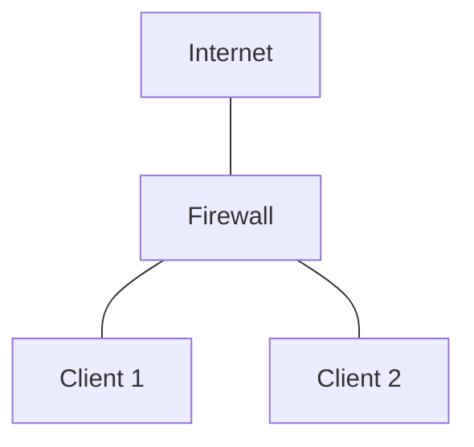

## Цель работы

Изучить архитектуру Netfilter/iptables, освоить базовую фильтрацию пакетов, stateful inspection, NAT, пользовательские цепочки и сохранение правил. На практике собрать стенд из трёх виртуальных машин в Proxmox, где один хост выполняет роль firewall/маршрутизатора между двумя другими хостами.

## Необходимое ПО и ресурсы

- Proxmox VE (любая актуальная версия).
- 3 виртуальные машины на базе Ubuntu Server 24.04.
- Два изолированных Linux-моста в Proxmox:
    - `C1.23.41-{{user_index}}-1`
    - `C1.23.41-{{user_index}}-2`
- Утилиты в ВМ: `iptables`, `openssh-server`, `iptables-persistent`, `tcpdump`, `conntrack`, `nmap`.

> [!INFO] Создание мостов
> `{{user_index}}` — номер студента по журналу. Например, для студента №1: `C1.23.41-1-1` и `C1.23.41-1-2`.

## Топология сети

|Узел|IP-адрес|Шлюз|Мост|Описание соединения|
|---|---|---|---|---|
|Firewall|DHCP|DHCP|vmbr0|Firewall ↔ INTERNET|
|Firewall|10.10.10.1/24|—|vmbrC1.23.41-{{user_index}}-1|Firewall ↔ Client 1|
|Firewall|192.168.2.1/24|—|vmbrC1.23.41-{{user_index}}-2|Firewall ↔ Client 2|
|Client 1|10.10.10.10/24|10.10.10.1|vmbrC1.23.41-{{user_index}}-1|Client 1 ↔ Firewall|
|Client 2|192.168.2.100/24|192.168.2.1|vmbrC1.23.41-{{user_index}}-2|Client 2 ↔ Firewall|
## Обозначения

- `<WAN>` — интерфейс Firewall, подключённый к `vmbr0` (например, `ens18`).
- `<LAN1>` — интерфейс Firewall, подключённый к мосту Client 1 (например, `ens19`).
- `<LAN2>` — интерфейс Firewall, подключённый к мосту Client 2 (например, `ens20`).

## Подготовка стенда в Proxmox

### 1. Создание виртуальных машин

Мосты уже созданы администратором. При создании ВМ нужно просто выбрать нужный мост в настройках сетевого устройства.

#### Firewall

Создайте ВМ с **тремя** сетевыми интерфейсами:

|Устройство|Мост|Назначение|
|---|---|---|
|net0|vmbr0|WAN|
|net1|vmbrC1.23.41-{{user_index}}-1|LAN1|
|net2|vmbrC1.23.41-{{user_index}}-2|LAN2|

Модель: **VirtIO (paravirtualized)**.

#### Client 1

Создайте ВМ с **одним** сетевым интерфейсом:

|Устройство|Мост|
|---|---|
|net0|vmbrC1.23.41-{{user_index}}-1|

#### Client 2

Создайте ВМ с **одним** сетевым интерфейсом:

|Устройство|Мост|
|---|---|
|net0|vmbrC1.23.41-{{user_index}}-2|

### 2. Как понять, какой интерфейс в Linux соответствует какому мосту

1. В Proxmox откройте **VM → Hardware**. Для каждого сетевого устройства будет указан **MAC-адрес**.
    
2. Запишите MAC-адреса:
    
    - Firewall: net0, net1, net2.
        
    - Client 1: net0.
        
    - Client 2: net0.
        
3. Зайдите в ВМ через консоль Proxmox (noVNC/SPICE) и выполните:
    

bash

ip -br link

Вы увидите примерно:

text

lo               UNKNOWN        00:00:00:00:00:00
ens18            UP             bc:24:11:aa:bb:cc
ens19            UP             bc:24:11:dd:ee:ff
ens20            UP             bc:24:11:11:22:33

Сопоставьте MAC-адреса из Proxmox с интерфейсами в Linux.  
Например:

- `ens18` → net0 (vmbr0, WAN)
    
- `ens19` → net1 (vmbrC1.23.41-{{user_index}}-1, LAN1)
    
- `ens20` → net2 (vmbrC1.23.41-{{user_index}}-2, LAN2)
    

> Если интерфейсы называются иначе (`enp0s18`, `eth0` и т.п.) — используйте свои имена.

### 3. Установка базового ПО

На **всех трёх ВМ** выполните:

bash

sudo apt update
sudo apt install -y iptables openssh-server iptables-persistent tcpdump conntrack nmap

Во время установки `iptables-persistent` может спросить о сохранении текущих правил.  
Для первичной настройки выберите **No** — сохраним позже вручную.

Проверьте SSH:

bash

sudo systemctl enable --now ssh
sudo systemctl status ssh
ss -tlnp | grep :22

### 4. Настройка IP-адресов через Netplan

В Ubuntu Server 24.04 сеть настраивается через Netplan.  
Создайте или отредактируйте файл `/etc/netplan/99-lab.yaml`.

#### Firewall

Замените `ens18`, `ens19`, `ens20` на свои интерфейсы.

yaml

network:
  version: 2
  renderer: networkd
  ethernets:
    ens18:
      dhcp4: true
    ens19:
      dhcp4: false
      addresses:
        - 10.10.10.1/24
    ens20:
      dhcp4: false
      addresses:
        - 192.168.2.1/24

Примените:

bash

sudo chmod 600 /etc/netplan/99-lab.yaml
sudo netplan apply

Проверьте:

bash

ip -br addr
ip route

Ожидаемо:

- `ens18` получил DHCP-адрес от vmbr0.
    
- `ens19` — `10.10.10.1/24`.
    
- `ens20` — `192.168.2.1/24`.
    

#### Client 1

yaml

network:
  version: 2
  renderer: networkd
  ethernets:
    ens18:
      dhcp4: false
      addresses:
        - 10.10.10.10/24
      routes:
        - to: default
          via: 10.10.10.1
      nameservers:
        addresses: [8.8.8.8, 1.1.1.1]

#### Client 2

yaml

network:
  version: 2
  renderer: networkd
  ethernets:
    ens18:
      dhcp4: false
      addresses:
        - 192.168.2.100/24
      routes:
        - to: default
          via: 192.168.2.1
      nameservers:
        addresses: [8.8.8.8, 1.1.1.1]

Примените на клиентах:

bash

sudo netplan apply

Проверьте связность:

- Client 1 → Firewall: `ping -c 3 10.10.10.1`
    
- Client 2 → Firewall: `ping -c 3 192.168.2.1`
    
- Firewall → Client 1: `ping -c 3 10.10.10.10`
    
- Firewall → Client 2: `ping -c 3 192.168.2.100`
    

### 5. Включение IP-форвардинга на Firewall

Без этого транзит пакетов между LAN1 и LAN2 работать не будет.

bash

sudo sysctl -w net.ipv4.ip_forward=1
echo 'net.ipv4.ip_forward=1' | sudo tee /etc/sysctl.d/99-ipforward.conf
sudo sysctl --system

Проверка:

bash

cat /proc/sys/net/ipv4/ip_forward

Должно быть `1`.

## Задачи на практическую работу

### Блок A. Базовая связность и маршрутизация

1. **Настроить сетевые настройки** согласно топологии: IP-адреса, шлюзы, мосты в Proxmox.
2. 
3. **Развернуть SSH-серверы** на всех трёх ВМ.
4. **Включить IP-форвардинг** на Firewall (без него транзит не работает).
5. **Разрешить `Client 1` пинговать `Client 2`** (сквозной ICMP через Firewall).
6. **Запретить `Client 2` пинговать `Client 1`** (асимметричная фильтрация).
7. **Разрешить SSH на Firewall с `Client 2`**, но запретить с `Client 1`.
8. **Проверить, что `Client 1` и `Client 2` видят интернет** через Firewall (базовый NAT/MASQUERADE).

### Блок B. Stateful inspection и политики

8. **Установить политику `DROP` по умолчанию** для цепочек `INPUT`, `FORWARD`, `OUTPUT` — так, чтобы не потерять управление (правило для `ESTABLISHED,RELATED` и SSH на firewall).
9. **Продемонстрировать «золотое правило»** `conntrack ESTABLISHED,RELATED` — без него ответы сервера не уходят клиенту.
10. **Логировать и считать** отброшенные пакеты: посмотреть счётчики через `iptables -L -n -v`, добиться ненулевых значений на `DROP`-правилах.

### Блок C. Продвинутая фильтрация (модули)

11. **Ограничить ICMP** на Firewall: разрешить пинг из локальной сети Client 2 (для мониторинга), но запретить из WAN. Использовать `-i` и/или `-m conntrack --ctstate NEW`.
12. **Rate limiting**: защитить SSH на Firewall от брутфорса через `-m limit` или `-m recent`. Проверить с помощью `nmap` или цикла `ssh` с неверным паролем.
13. **multiport**: разрешить на Firewall доступ к портам `22,80,443` одной строкой вместо трёх правил.
14. **Фильтрация по MAC-адресу**: разрешить `Client 1` доступ к Firewall только с его MAC (`-m mac --mac-source`). Проверить, что при смене MAC (например, на Client 2) доступ пропадает.
15. **time-модуль**: разрешить доступ к какому-либо сервису на Firewall только в «рабочие часы» (например, 09:00–18:00 по будням). Проверить сменой системного времени.

### Блок D. NAT и проброс портов

19. **SNAT/MASQUERADE**: настроить выход в интернет для обеих внутренних подсетей через `POSTROUTING MASQUERADE`.
20. **DNAT (проброс порта)**: пробросить порт `2222` на внешнем интерфейсе Firewall на SSH `Client 1` (порт 22). Проверить подключение снаружи (`ssh -p 2222 user@<внешний_IP>`).
21. **Обратный DNAT**: сделать так, чтобы `Client 2` мог обращаться к `Client 1` не по внутреннему IP, а по «публичному» адресу Firewall (hairpin NAT / NAT loopback). Это классическая сложная задача — потребуется дополнительный SNAT/MASQUERADE для внутреннего трафика.
22. **Разделение NAT**: сделать так, чтобы `Client 1` выходил в интернет через один внешний адрес, а `Client 2` — через другой (если есть два внешних IP / два интерфейса). Иначе — продемонстрировать `SNAT --to-source` с фиксированным адресом.

### Блок E. Диагностика и сохранение

23. **Снять дамп трафика** через `tcpdump` на интерфейсе Firewall, убедиться, что видно трансляцию адресов (до и после NAT).
24. **Посмотреть таблицу conntrack**: `conntrack -L` — увидеть активные сессии, их состояния, таймауты.
25. **Сбросить счётчики** через `iptables -Z` и заново снять статистику.
26. **Сохранить правила** через `iptables-persistent` / `netfilter-persistent save`. Перезагрузить Firewall, убедиться, что правила применились.
27. **Смоделировать «блокировку самого себя»**: поставить `-P INPUT DROP` без правила для SSH — показать, как восстановить доступ через консоль Proxmox (noVNC/SPICE).