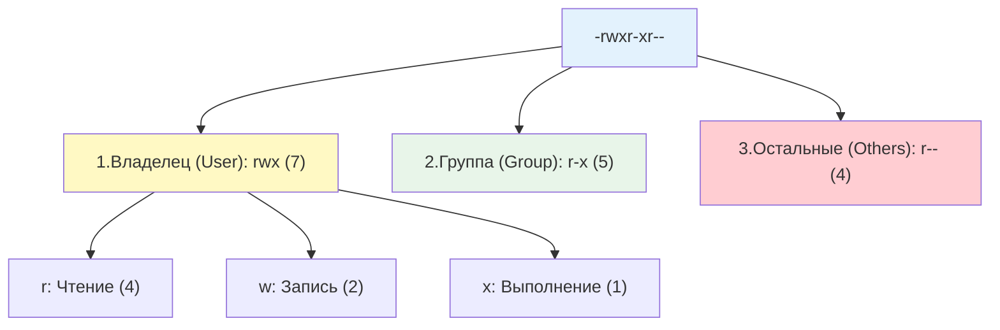

**Права доступа (permissions)** — это набор правил, которые определяют, кто может читать, изменять или выполнять файл или директорию. В Linux каждый файл и директория имеют:

- **Владельца (owner)** — пользователь, который создал файл или которому он был назначен
- **Группу (group)** — группа пользователей, имеющая определенные права на этот файл
- **Три типа прав** для владельца, группы и всех остальных: чтение (r), запись (w), выполнение (x)

## 1. Стандартная модель прав (rwx)

### Как хранятся права в файловой системе

Каждый файл в Linux имеет метаданные, которые хранятся в **inode** — специальной структуре данных. Inode содержит:

- UID владельца (числовой идентификатор)
- GID группы (числовой идентификатор)
- Права доступа (9 бит + 3 специальных бита)
- Размер файла, временные метки, расположение блоков на диске

Когда вы видите права через `ls -l`, система читает эти биты из inode и отображает их в текстовом виде.

### Структура прав

Каждый файл и директория имеют владельца (User/Owner) и группу (Group). Права делятся на три категории по 3 бита каждая.



**Как читать строку прав:**

- **Первый символ** (`-`, `d`, `l`): тип файла
    - `-` — обычный файл
    - `d` — директория
    - `l` — символическая ссылка
- **Следующие 9 символов** разбиты на три группы по 3:
    - Позиции 2-4: права владельца (`rwx`)
    - Позиции 5-7: права группы (`r-x`)
    - Позиции 8-10: права остальных (`r--`)

### Значение прав для файлов и директорий

|Право|Символ|Число|Для файла|Для директории|
|---|---|---|---|---|
|**Read**|`r`|4|Чтение содержимого файла (открыть в редакторе, просмотреть через `cat`)|Просмотр списка файлов в директории (`ls`)|
|**Write**|`w`|2|Изменение содержимого файла (редактирование, перезапись)|Создание, удаление, переименование файлов внутри директории|
|**Execute**|`x`|1|Запуск файла как программы или скрипта (`./script.sh`)|Вход в директорию (`cd`) и доступ к метаданным файлов внутри|

>[!WARNING]  Что означают права для директории
>Для директории `r`, `w`, `x` значат не то же самое, что для файла:
>- `r` — можно **прочитать список** имён внутри (`ls`);
>- `w` — можно **создавать, удалять и переименовывать** файлы внутри;
>- `x` — можно **войти** в директорию и обращаться к файлам по имени (`cd`, доступ к содержимому).
>- Поэтому «удалить файл» определяется правами на **директорию**, а не на сам файл.

### Числовое представление прав

Каждое право имеет числовое значение:

- `r` (read) = 4
- `w` (write) = 2
- `x` (execute) = 1
- `-` (отсутствие права) = 0

Права для каждой категории (владелец, группа, остальные) складываются:

**Пример:** `rwxr-xr--`

- Владелец: `rwx` = 4 + 2 + 1 = **7**
- Группа: `r-x` = 4 + 0 + 1 = **5**
- Остальные: `r--` = 4 + 0 + 0 = **4**
- Итого: **754**

> [!TIP] Популярные комбинации прав
> 
> - **755** (`rwxr-xr-x`) — стандарт для директорий и исполняемых файлов: владелец может всё, остальные могут читать и выполнять
> - **644** (`rw-r--r--`) — стандарт для обычных файлов: владелец может читать и изменять, остальные только читать
> - **600** (`rw-------`) — строгие права для конфиденциальных файлов (SSH-ключи, пароли): только владелец может читать и изменять
> - **700** (`rwx------`) — приватная директория: только владелец имеет полный доступ

## Изменение прав и владельцев: chmod, chown, chgrp

### Символьный режим chmod

Символьный режим удобно использовать для точечных изменений без необходимости высчитывать числа.

**Синтаксис:** `chmod [кто][операция][права] файл`

**Кто:**

- `u` — владелец (user)
- `g` — группа (group)
- `o` — остальные (others)
- `a` — все (all) = `ugo`

**Операция:**

- `+` — добавить право
- `-` — убрать право
- `=` — установить точно указанные права (остальные сбрасываются)

**Права:**

- `r` — чтение
- `w` — запись
- `x` — выполнение

```bash
# Добавить право на выполнение владельцу и группе
# Что происходит: к текущим правам владельца и группы добавляется бит x
chmod ug+x script.sh

# Убрать право на запись для всех остальных
# Что происходит: из прав остальных убирается бит w
chmod o-w config.txt

# Установить точные права: владелец rwx, группа r-x, остальные ---
# Что происходит: права устанавливаются точно как указано, остальные биты сбрасываются
chmod u=rwx,g=rx,o=--- app.bin

# Добавить выполнение всем
chmod a+x script.sh
# или сокращенно:
chmod +x script.sh
```

### Числовой (восьмеричный) режим chmod

Числовой режим быстрее для установки всех прав сразу.

![[chmod-20231121161213435.webp]]

```bash
# 755: rwxr-xr-x (часто для скриптов и веб-директорий)
# Что происходит: устанавливаются права 7 для владельца, 5 для группы, 5 для остальных
chmod 755 /var/www/html

# 644: rw-r--r-- (стандарт для обычных файлов, например, конфигов)
# Что происходит: владелец может читать и изменять (6), остальные только читать (4)
chmod 644 /etc/nginx/nginx.conf

# 600: rw------- (строгие права, например, для приватных SSH-ключей)
# Что происходит: только владелец может читать и изменять, все остальные не имеют доступа
chmod 600 ~/.ssh/id_rsa

# 700: rwx------ (приватная директория)
# Что происходит: только владелец имеет полный доступ
chmod 700 ~/.ssh
```

> [!TIP] Когда какой режим использовать
> 
> - **Символьный** — когда нужно добавить или убрать одно право (например, `chmod +x script.sh`)
> - **Числовой** — когда нужно установить все права сразу (например, `chmod 644 config.txt`)

### Смена владельца и группы: chown, chgrp

**`chown` (change owner)** — изменяет владельца и/или группу файла. **`chgrp` (change group)** — изменяет только группу (это просто обертка над `chown`).

**Что происходит при изменении владельца:**

- В inode файла обновляется поле UID (и/или GID)
- Права доступа (rwx) остаются прежними, но применяются к новому владельцу/группе
- Только root может изменить владельца файла (обычный пользователь не может передать файл другому пользователю)

```bash
# Изменить только владельца
# Что происходит: UID файла меняется на UID пользователя alice
chown alice file.txt

# Изменить владельца и группу одновременно (через двоеточие)
# Что происходит: UID меняется на alice, GID меняется на developers
chown alice:developers file.txt

# Рекурсивное изменение для директории и всего её содержимого
# Что происходит: все файлы и поддиректории внутри /var/www/html меняют владельца и группу
chown -R www-data:www-data /var/www/html

# Изменить только группу (аналог chgrp)
# Что происходит: GID файла меняется на developers, владелец остается прежним
chown :developers file.txt
```

>[!WARNING] Осторожно с рекурсивным chown
>Команда `chown -R` изменяет права на все файлы внутри директории. Если вы случайно укажете неправильный путь (например, `/` вместо `/var/www`), вы можете сломать всю систему. Всегда проверяйте путь перед выполнением.

## SUDO

**sudo** (Superuser Do) — это фундаментальный механизм делегирования привилегий в Linux. Вместо того чтобы давать пользователям пароль суперпользователя (`root`) или переключаться на него через `su`, `sudo` позволяет гибко и аудиторски контролируемо предоставлять права на выполнение конкретных команд от имени других пользователей.

### Синтаксис файла sudoers

Файл `/etc/sudoers` имеет строгий формат. Каждая строка правила описывается следующей схемой: