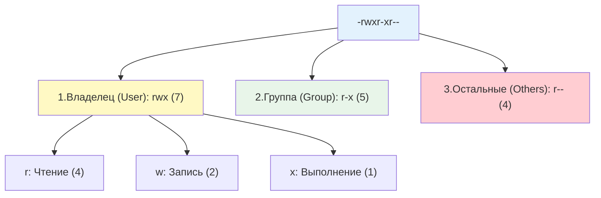

**Права доступа (permissions)** — это набор правил, которые определяют, кто может читать, изменять или выполнять файл или директорию. В Linux каждый файл и директория имеют:

- **Владельца (owner)** — пользователь, который создал файл или которому он был назначен
- **Группу (group)** — группа пользователей, имеющая определенные права на этот файл
- **Три типа прав** для владельца, группы и всех остальных: чтение (r), запись (w), выполнение (x)

## 1. Стандартная модель прав (rwx)

### Как хранятся права в файловой системе

Каждый файл в Linux имеет метаданные, которые хранятся в **inode** — специальной структуре данных. Inode содержит:

- UID владельца (числовой идентификатор)
- GID группы (числовой идентификатор)
- Права доступа (9 бит + 3 специальных бита)
- Размер файла, временные метки, расположение блоков на диске

Когда вы видите права через `ls -l`, система читает эти биты из inode и отображает их в текстовом виде.

### Структура прав

Каждый файл и директория имеют владельца (User/Owner) и группу (Group). Права делятся на три категории по 3 бита каждая.

**Как читать строку прав:**

- **Первый символ** (`-`, `d`, `l`): тип файла
    - `-` — обычный файл
    - `d` — директория
    - `l` — символическая ссылка
- **Следующие 9 символов** разбиты на три группы по 3:
    - Позиции 2-4: права владельца (`rwx`)
    - Позиции 5-7: права группы (`r-x`)
    - Позиции 8-10: права остальных (`r--`)