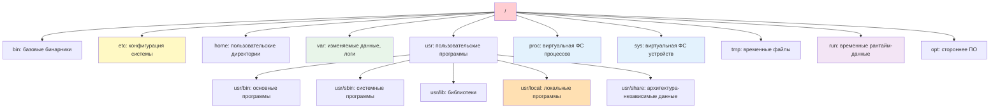

## Введение

Терминал (command-line interface, CLI) — это основной интерфейс взаимодействия администратора с Linux-системами. Понимание принципов работы оболочки (shell), навигации по файловой системе и базовых операций с файлами — это **фундамент**, без которого невозможна эффективная автоматизация, диагностика и управление инфраструктурой.

## 1. Терминал, консоль, shell: в чем разница?


|Термин|Описание|Пример|
|---|---|---|
|**Консоль (TTY)**|Физический или виртуальный текстовый интерфейс|`tty1`-`tty6`, `pts/0` для SSH|
|**Terminal Emulator**|Программа, эмулирующая терминал в GUI|GNOME Terminal, Konsole, Alacritty, WezTerm|
|**Shell**|Интерпретатор команд, оболочка между пользователем и ОС|`bash`, `zsh`, `fish`, `sh`|
|**Prompt**|Строка приглашения ввода, показывает контекст|`user@host:~/project$`|

| Термин                    | Описание                                                     | Пример           |
| ------------------------- | ------------------------------------------------------------ | ---------------- |
| **TTY** (TeleTYpewriter)  | Исторический термин, сейчас обозначает любой текстовый сеанс | `tty`, `pts/2`   |
| **PTY** (Pseudo-Terminal) | Программный терминал, создаваемый эмулятором или SSH         | `pts/0`, `pts/1` |

**Типы shell по происхождению**

| Shell    | Особенности                                                                |
| -------- | -------------------------------------------------------------------------- |
| **sh**   | Минималистичный, POSIX-стандарт, используется в скриптах для переносимости |
| **bash** | Самый распространённый, есть автодополнение, история, job control          |
| **zsh**  | Расширенное автодополнение, темы, плагины (стал стандартом на macOS)       |
| **fish** | Умный синтаксис и подсказки "из коробки", но не совместим с bash-скриптами |
### Проверка текущего окружения

> [!NOTE] Разбор строки приглашения `user@host:~/project$`:
> Когда мы успешно авторизуемся у нас открывается строка приглашения к вводу:
> - `~` — это домашняя директория, _сокращение_, а не реальный путь.
> - Символ `$` говорит, что ты обычный пользователь, `#` — root. Это **критично** для безопасности (чтобы случайно не вводить опасные команды под root). 

```bash
# Какой shell используется сейчас
echo $SHELL

# Текущий TTY
tty

# Версия bash
bash --version

# Список доступных shell в системе
cat /etc/shells
```

## 2. Структура файловой системы Linux (FHS)

### Иерархия ключевых директорий



>[!NOTE] Симлинки в современных системах  
В дистрибутивах начиная с Ubuntu 20.04, RHEL 8+, Debian 10+ директории `/bin`, `/sbin`, `/lib` являются символическими ссылками на соответствующие директории в `/usr`. Это сделано для упрощения структуры. На практике все бинарники в `/usr/bin/`, все системные утилиты — в `/usr/sbin/`.

| Директория  | Назначение                                            | DevOps use-case                                                                                                                                |
| ----------- | ----------------------------------------------------- | ---------------------------------------------------------------------------------------------------------------------------------------------- |
| `/etc`      | Конфигурационные файлы системы и сервисов             | Правка `sshd_config`, `nginx.conf`, `systemd` юнитов. Всегда делай бэкап перед правкой: `cp /etc/nginx/nginx.conf{,.bak}`                      |
| `/var/log`  | Логи приложений и системных сервисов                  | Анализ ошибок и различных события: `journalctl`, `tail -f /var/log/syslog`. Первое место куда нужно смотреть при отладке                       |
| `/var/lib`  | Данные сервисов: БД, пакеты, состояния                | Бэкап PostgreSQL: `/var/lib/postgresql`, Docker: `/var/lib/docker`. При удалении пакета через `apt remove` данные здесь часто **не удаляются** |
| `/home`     | Домашние директории пользователей                     | SSH-ключи: `~/.ssh`, конфиги CLI: `~/.aws`, `~/.kube`                                                                                          |
| `/tmp`      | Временные файлы (очищаются при перезагрузке)          | Промежуточные данные, тестовые данные. На некоторых системах монтируется как `tmpfs` (в ОЗУ) — большие файлы не клади                          |
| `/run`      | Временные рантайм-данные (tmpfs в ОЗУ)                | PID-файлы и сокеты работающих сервисов (Docker, MySQL, systemd). Очищается при каждой загрузке                                                 |
| `/proc`     | Виртуальная ФС: информация о процессах и ядре         | Диагностика: `cat /proc/<PID>/status`, `cat /proc/meminfo`, `cat /proc/loadavg`. Только для чтения                                             |
| `/sys`      | Виртуальная ФС: информация об устройствах и драйверах | Управление железом: `echo 0 > /sys/devices/system/cpu/cpu1/online`. Требует осторожности                                                       |
| `/opt`      | Стороннее ПО, установленное вручную                   | Установка бинарников: Terraform, kubectl, Helm                                                                                                 |
| `/usr/bin`  | Основные программы, установленные пакетным менеджером | `apt`, `dnf`, `pip` кладут сюда исполняемые файлы                                                                                              |
| `/usr/sbin` | Системные утилиты для администрирования               | `fdisk`, `iptables`, `systemctl` — обычно требуют прав root                                                                                    |

>[!TIP] Где искать конфиги?
>1. Системные сервисы → `/etc/<service>/`
>2. Пользовательские настройки → `~/.config/` или `~/.*` (скрытые файлы).
>3. Временная конфигурация → `/run/<service>/` (пересоздаётся при старте)

## 3. Базовые команды навигации и работы с файлами

### Навигация по директориям

```bash
# Показать текущую директорию
pwd

# Список файлов и директорий
ls -la          # все файлы, включая скрытые, с деталями
ls -lh /var/log # человеческий формат размеров

# Переход между директориями
cd /var/log     # абсолютный путь
cd ../lib       # относительный путь (на уровень выше)
cd ~            # в домашнюю директорию

# Автодополнение путей: TAB-уляция
cd /var/log/<TAB>  # покажет варианты
```

### Операции с файлами и директориями

| Команда    | Назначение                                                | Пример                                                                |
| ---------- | --------------------------------------------------------- | --------------------------------------------------------------------- |
| `mkdir -p` | Создание директории с родительскими папками               | `mkdir -p project/{src,tests,docs}` — создаст сразу три поддиректории |
| `touch`    | Создание пустого файла или обновление timestamp           | `touch file.txt`, `touch -t 202601011200 file.txt`                    |
| `cp`       | Копирование файлов                                        | `cp file.txt file_backup.txt`                                         |
| `cp -r`    | Копирование директорий рекурсивно                         | `cp -r config/ backup/config_$(date +%F)`                             |
| `cp -a`    | Копирование с сохранением атрибутов (владельца, прав)     | `cp -a /etc/nginx /backup/nginx`                                      |
| `mv`       | Перемещение или переименование                            | `mv old_name.txt new_name.txt`, `mv file.txt /tmp/`                   |
| `rm`       | Удаление файлов                                           | `rm file.txt`                                                         |
| `rm -rf`   | Удаление директорий рекурсивно с принудительным удалением | `rm -rf /tmp/build/*`                                                 |
| `rmdir`    | Удаление пустой директории                                | `rmdir empty_dir/`                                                    |

> [!ERROR] Опасные команды
> - `rm -rf /` — удалит всю файловую систему
> - `rm -rf *` в корне домашней директории — удалит все файлы
> - Всегда проверяйте путь перед выполнением деструктивных команд: `echo rm -rf /путь/к/файлам`

### Просмотр содержимого файлов

```bash
# Полное содержимое (для коротких файлов)
cat config.yaml
cat -n config.yaml          # с нумерацией строк

# Постраничный просмотр
less /var/log/syslog        # навигация: стрелки, /поиск, q-выход

# Первые строки
head -n 20 app.log          # первые 20 строк

# Последние строки
tail -n 50 app.log          # последние 50 строк
tail -n +10 app.log         # начиная с 10-й строки до конца
tail -f app.log             # режим реального времени (follow)

# Простой текстовый редактор в терминале
nano file.txt               # базовый редактор
vim file.txt                # продвинутый редактор
```

### Поиск по содержимому (grep)

```bash
# Базовый поиск строки в файлах
grep "api_key" app.log

# Рекурсивный поиск строки в директории
grep -r "api_key" /home/user/project/

# Подсчет количества совпадений
grep -c "ERROR" app.log

# Инвертированный поиск (все строки без совпадения)
grep -v "DEBUG" app.log

# Поиск целого слова
grep -w "error" app.log     # найдет "error" но не "erroring"

# Поиск по нескольким паттернам
grep -e "ERROR" -e "WARN" app.log
```

> [!TIP] Эффективный просмотр логов
> Комбинируйте `tail -f` с `grep` для фильтрации в реальном времени:

```bash
tail -f /var/log/app.log | grep --line-buffered "ERROR\|Exception"
```

## 4. Пути: абсолютные, относительные, специальные

|Обозначение|Значение|Пример|
|---|---|---|
|`/`|Корень файловой системы|`/etc`, `/usr/bin`|
|`~`|Домашняя директория текущего пользователя|`~/.ssh/id_rsa`|
|`.`|Текущая директория|`./script.sh`|
|`..`|Родительская директория|`../config.yaml`|
|`-`|Предыдущая директория (для `cd`)|`cd -`|

## 5. Права доступа и владение (basics)

### Отображение прав: `ls -l`

```bash
$ ls -l /etc/nginx/nginx.conf
-rw-r--r-- 1 root root 2.4K Jan 15 10:30 /etc/nginx/nginx.conf
```

Разбор строки:

```
[-][rwx][rwx][rwx] [links] [owner] [group] [size] [date] [path]
 |    |    |    |
 |    |    |    +-- Others: read
 |    |    +------- Group: read
 |    +------------ Owner: read+write
 +----------------- Тип: - (файл), d (директория), l (ссылка)
```

Тип файла в первом символе:

|Символ|Значение|
|---|---|
|`-`|обычный файл|
|`d`|директория|
|`l`|символическая ссылка|
|`c` / `b`|символьное / блочное устройство|
|`s` / `p`|сокет / named pipe|

### Права в числовом виде

Каждая тройка `rwx` — это три бита, которые складываются в одну цифру:

|Бит|Значение|
|---|---|
|`r`|4|
|`w`|2|
|`x`|1|

Отсюда `rwx` = 7, `rw-` = 6, `r--` = 4, `---` = 0. Запись `644` расшифровывается как `rw-r--r--`, а `755` — как `rwxr-xr-x`.

Полезно помнить частые комбинации:

- `600` — только владелец читает и пишет (типично для приватных ключей);
- `644` — владелец пишет, все остальные читают (обычные файлы);
- `700` — полный доступ только владельцу (приватные директории);
- `755` — владелец всё, остальные читают и заходят (исполняемые файлы, публичные каталоги).
### Что означают права для директории

Для директории `r`, `w`, `x` значат не то же самое, что для файла:

- `r` — можно **прочитать список** имён внутри (`ls`);
- `w` — можно **создавать, удалять и переименовывать** файлы внутри;
- `x` — можно **войти** в директорию и обращаться к файлам по имени (`cd`, доступ к содержимому).

Поэтому «удалить файл» определяется правами на **директорию**, а не на сам файл.

## 6. Поиск файлов и контента

### Поиск по имени и атрибутам: `find`

```bash
# Поиск по имени файла (чувствительность к регистру)
find /var -name "*.log"          # точное совпадение
find /var -iname "*.log"         # без учета регистра

# Поиск по типу
find /home -type f               # только файлы
find /home -type d               # только директории

# Поиск по времени изменения
find /etc -mtime -1              # изменены за последние 24 часа
find /etc -mtime +7              # изменены более 7 дней назад
find /etc -mmin -30              # изменены за последние 30 минут
find /etc -ctime -2              # созданы/изменены за последние 2 дня

# Поиск по размеру
find /home -type f -size +100M   # больше 100 MB
find /home -type f -size -1M     # меньше 1 MB
find /home -type f -size 0       # пустые файлы

# Поиск и удаление старых временных файлов
find /tmp -type f -name "*.tmp" -mtime +7 -delete

# Поиск и выполнение команды над результатами
find . -name "*.txt" -exec cp {} /backup/ \;

# Ограничение глубины поиска
find /var -maxdepth 2 -name "*.log"  # искать только в /var и его поддиректориях 1-го уровня
find /var -mindepth 3 -name "*.log"  # искать с глубины от 3 и глубже
```

>[!NOTE] Ключевые параметры `find`
>- `-name` — чувствительный к регистру, `-iname` — без учета регистра  
>- `-type f` — файлы, `-type d` — директории
>- `-mtime` — время изменения (в днях), `-mmin` — в минутах
>- `-exec {} \;` — выполнить команду для каждого найденного файла
>- `-exec {} +` — выполнить команду один раз со всеми файлами (быстрее)

> [!ERROR] Осторожно с `find -exec`
> - `-exec {} \;` создает новый процесс для каждого файла — может быть медленным для тысяч файлов
> - `-exec {} +` группирует файлы и вызывает команду один раз — быстрее
> - Всегда проверяй результат без деструктивных действий: `find . -name "*.tmp" -exec echo {} \;`

## 7. Работа с архивами и сжатием

**Архивирование** — объединение нескольких файлов и директорий в один контейнерный файл (архив) с сохранением структуры путей, имён, прав и метаданных. Само по себе архивирование **не уменьшает** размер данных.

**Сжатие** — уменьшение размера данных за счёт устранения избыточности. Бывает **без потерь** (lossless, данные восстанавливаются побитово — именно оно используется в Unix-утилитах) и **с потерями** (lossy, часть информации отбрасывается — например, в JPEG или MP3).

**Компрессия vs архивация** — разные задачи, которые часто комбинируют: `tar` собирает файлы в один поток, а `gzip`/`bzip2`/`xz` сжимают этот поток. Отсюда имена вроде `.tar.gz`.

**Степень сжатия** (compression level) — параметр, задающий баланс между скоростью и итоговым размером. Обычно диапазон от `-1` (быстро, слабо) до `-9` (медленно, максимально). По умолчанию чаще всего `-6`.

**Коэффициент сжатия** — отношение исходного размера к сжатому. Сильно зависит от типа данных: тексты, логи и исходный код сжимаются хорошо, а уже сжатые файлы (JPEG, MP4, `.gz`) — почти нет.

### Основные утилиты

| Утилита                | Назначение                               | Пример                                |
| ---------------------- | ---------------------------------------- | ------------------------------------- |
| `tar`                  | Архивирование (со сжатием или без)       | `tar -czf backup.tar.gz /data`        |
| `gzip`/`gunzip`        | Сжатие/распаковка .gz                    | `gzip large.log`, `gunzip file.gz`    |
| `bzip2`/`bunzip2`      | Сжатие .bz2 (сильнее, но медленнее gzip) | `bzip2 large.log`, `bunzip2 file.bz2` |
| `xz`/`unxz`            | Сжатие .xz (максимальная степень)        | `xz -9 large.log`, `unxz file.xz`     |
| `zip`/`unzip`          | ZIP-архивы (кросс-платформенные)         | `zip -r project.zip ./src`            |

### Практические примеры с `tar`

```bash
# Создать архив со сжатием gzip
tar -czf backup.tar.gz /var/lib/postgresql

# Создать архив со сжатием bzip2 (сильнее)
tar -cjf backup.tar.bz2 /var/log

# Создать архив со сжатием xz (максимальное)
tar -cJf backup.tar.xz /home/user/project

# Добавить файлы в существующий архив (без сжатия)
tar -rf archive.tar newfile.txt

# Просмотреть содержимое архива без распаковки
tar -tzf archive.tar.gz
tar -tvf archive.tar              # подробный вывод с правами и размерами

# Распаковать в конкретную директорию
tar -xzf archive.tar.gz -C /restore/path

# Извлечь только определенные файлы
tar -xzf backup.tar.gz var/log/app/error.log
```

### Практические примеры с `zip`

```bash
# Создать zip-архив рекурсивно
zip -r project.zip ./src ./configs

# Создать архив с исключением
zip -r backup.zip /var/log -x "*.tmp" "*.cache"

# Создать архив с паролем
zip -e secure.zip sensitive_data.txt   # запросит пароль

# Просмотреть содержимое
unzip -l archive.zip

# Распаковать с сохранением структуры
unzip archive.zip -d /target/path

# Распаковать только определенные файлы
unzip archive.zip "*.txt" -d ./extracted/
```

>[!TIP] Выбор формата для бэкапов
>- **Логи и текстовые файлы** → gzip (быстро, достаточно сжатия)
>- **Большие файлы (БД, образы VM)** → xz (максимальное сжатие, но дольше)
>- **Кросс-платформенные архивы** → zip (поддерживается везде, включая Windows)

## 8. Переменные окружения и алиасы

**Переменная** — именованное значение, которое шелл хранит в памяти во время сессии. Используется для передачи данных командам, настройки поведения программ и хранения путей.

**Shell-переменная** — существует только внутри текущего экземпляра шелла и **не передаётся** дочерним процессам.

**Переменная окружения (environment variable)** — экспортированная переменная, которая наследуется всеми дочерними процессами. Именно её видит запускаемая программа. Разница принципиальна: `VAR=1` без `export` останется внутри шелла, а `export VAR=1` попадёт в окружение потомков.

**Область видимости** — переменные не «глобальны» для системы. Каждая сессия терминала, каждый скрипт, каждый подшелл имеют своё окружение, унаследованное от родителя на момент запуска.

**`PATH`** — ключевая переменная окружения: список директорий через `:`, в которых шелл ищет исполняемые файлы, когда вы вводите команду без полного пути. Порядок в `PATH` определяет приоритет: если `foo` есть в двух директориях, выполнится та, что стоит раньше.

**Алиас** — короткое имя-синоним для команды (или команды с аргументами), которое шелл подставляет на этапе разбора строки. Это не отдельная программа и не файл, а просто правило подстановки внутри текущего шелла.

### Работа с переменными

```bash
# Просмотр всех переменных
env
printenv

# Просмотр конкретной переменной
echo $PATH
echo $HOME

# Установка переменной (только для текущей сессии)
export APP_ENV=production
export SUPER_SECRET="secret123"

# Установка переменной только для одной команды
SUPER_SECRET=secret ./deploy.sh

# Постоянные переменные: добавление в ~/.bashrc
echo 'export PATH="$HOME/bin:$PATH"' >> ~/.bashrc
source ~/.bashrc  # применить изменения

# удалить переменную
unset PATH
```

### Где хранятся постоянные настройки

|Файл|Когда читается|Для чего|
|---|---|---|
|`~/.bashrc`|при запуске интерактивного **нелогин**-шелла (каждый новый терминал)|алиасы, функции, локальные переменные|
|`~/.profile` / `~/.bash_profile`|при логине|`PATH` и прочие переменные окружения|
|`/etc/profile`, `/etc/bash.bashrc`|системно, до пользовательских|настройки для всех пользователей|

После правки файла изменения не применяются автоматически — нужно либо открыть новый терминал, либо выполнить `source ~/.bashrc`.

### Алиасы для ускорения работы

```bash
# Временный алиас (текущая сессия)
alias ll='ls -lah'
alias ..='cd ..'
alias ipa='ip -c -br a'
```

```bash
alias                    # список всех активных алиасов
type ipa                  # узнать, что скрывается за именем
unalias ll               # удалить алиас
```

## 9. История команд и эффективный ввод

### Управление историей

```bash
# Просмотр истории
history
history | grep "192.168.1.1"

# Повтор последней команды
!!

# Выполнить команду по номеру из history
!123

# Очистить историю
history -c
```

### Горячие клавиши для продуктивности

| Комбинация          | Действие                                 |
| ------------------- | ---------------------------------------- |
| `Ctrl+A` / `Ctrl+E` | В начало / в конец строки                |
| `Ctrl+Left/Right`   | Перемещение по словам                    |
| `Ctrl+L`            | Очистить экран (аналог `clear`)          |
| `Ctrl+C`            | Прервать текущую команду                 |
| `Ctrl+Z`            | Отправить процесс в фон (suspend)        |
| `fg` / `bg`         | Вернуть процесс на передний план / в фон |
## Контрольные вопросы для самопроверки

1. В чем разница между абсолютным и относительным путем? Когда целесообразно использовать каждый из них в скриптах?
2. Что означает строка прав `drwxr-x---` и кто может выполнять операции с такой директорией?
3. Как найти все файлы `.conf`, измененные за последние 3 дня, и скопировать их в бэкап-директорию одной командой?
4. Почему `rm -rf *` может быть опасен даже в домашней директории? Как защитить себя от случайного удаления?
5. Как добавить новую переменную окружения так, чтобы она сохранялась после перезагрузки терминала?


#### 1. Вопрос

**Абсолютный путь** начинается с `/` и отсчитывается от корня файловой системы: `/etc/nginx/nginx.conf`. Он однозначен — не зависит от того, где вы находитесь.

**Относительный путь** отсчитывается от текущей рабочей директории: `conf/nginx.conf`, `../logs/app.log`, `./script.sh`. Коротко, но зависит от `pwd`.

#### 2. Вопрос

Числовая запись — `750`. Операции:

- **Владелец** — полный доступ: `ls`, `cd`, создание/удаление/переименование файлов.
- **Группа** — может прочитать список имён и войти в директорию (`cd`, доступ к файлам по имени), но **не может** создавать, удалять или переименовывать файлы внутри.
- **Остальные** — не могут ничего: ни `ls`, ни `cd`, ни обратиться к файлам.

#### 3. Вопрос

```bash
find /etc -type f -name '*.conf' -mtime -3 -exec cp -v {} /backup/ \;
```

Разбор:

- `-type f` — только обычные файлы;
- `-name '*.conf'` — по маске (кавычки, чтобы shell не развернул сам);
- `-mtime -3` — изменены **менее** 3 суток назад (`+3` — более 3 суток назад, `3` — ровно 3);
- `-exec cp {} /backup/ \;` — выполнить `cp` для каждого найденного файла.

#### 4. Вопрос

Опасность складывается из трёх вещей:

- `*` разворачивается shell-ом в **все** файлы текущей директории, включая скрытые? Нет — скрытые (`.*`) не входят, но всё остальное да.
- `-r` рекурсивно удаляет директории, `-f` отключает запросы подтверждения — то есть никаких «вы уверены?».
- Если текущая директория оказалась **не той**, что вы думали (например, вы сделали `cd` в скрипте, а он упал посреди пути), удалится не то.

Отдельный классический кошмар — опечатка в переменной: `rm -rf $DIR/` при пустом `$DIR` превращается в `rm -rf /`.

**Как защититься:**

- Всегда проверяйте `pwd` и `ls` перед массовым удалением.
- Используйте `rm -i` или `rm -I` (запрос при удалении более 3 файлов) для интерактивной работы.
- В скриптах — `set -u`, чтобы обращение к необъявленной переменной останавливало выполнение.
- Ставьте `--` перед масками: `rm -rf -- *` — тогда файл с именем `-rf` не будет воспринят как флаг.
- Держите бэкапы и по возможности используйте `trash-cli` вместо `rm`.
- Никогда не запускайте `rm -rf` от `root` без крайней необходимости.

#### 5. Вопрос

Нужно добавить `export` в файл, который читается при старте shell для текущего пользователя:

```bash
echo 'export APP_ENV=production' >> ~/.bashrc
source ~/.bashrc
```

Проверка: `printenv APP_ENV` в **новом** терминале.

