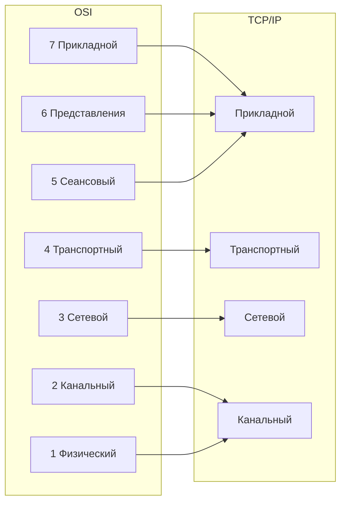

## 1. LAN и WAN

### Что такое LAN

**LAN** (Local Area Network) — локальная вычислительная сеть, объединяющая устройства на ограниченной территории.

**Характерные черты:**

- **География:** дом, офис, этаж, здание, кампус. Обычно до нескольких километров.
- **Скорость:** от 100 Мбит/с до 100 Гбит/с и выше.
- **Задержка:** микросекунды — миллисекунды.
- **Владение:** организация или пользователь владеет и управляет всей инфраструктурой.
- **Технологии:** Ethernet (IEEE 802.3), Wi-Fi (IEEE 802.11).
- **Адресация:** MAC-адреса (L2) + IP-адреса (L3). Часто используются приватные диапазоны.
- **Топология:** звезда (наиболее распространена), кольцо, шина (устарела), mesh.
- **Устройства:** коммутаторы, точки доступа, мосты, сетевые карты.

**Типы LAN:**

- **Проводная (Ethernet):** витая пара, оптика. Стабильна, безопасна, высокая скорость.
- **Беспроводная (WLAN):** Wi-Fi. Удобна, но подвержена помехам и атакам.
- **Виртуальная (VLAN):** логическое разделение одного физического коммутатора.

**Что находится внутри LAN:**

- Один или несколько **широковещательных доменов**.
- Коммутаторы L2 пересылают кадры по MAC-адресам.
- Маршрутизатор может делить LAN на подсети (VLAN + L3).

**Пример:** домашняя сеть: роутер, ноутбук, телефон, ТВ. Всё это — LAN.

### Что такое WAN

**WAN** (Wide Area Network) — глобальная сеть, соединяющая LAN через большие расстояния.

**Характерные черты:**

- **География:** город, регион, страна, континент, весь мир.
- **Скорость:** обычно ниже LAN, но может быть высокой (до 100 Гбит/с на магистралях).
- **Задержка:** от единиц до сотен миллисекунд.
- **Владение:** инфраструктура принадлежит провайдерам (ISP, операторам связи).
- **Технологии:** MPLS, PPP, HDLC, Frame Relay, ATM, Ethernet поверх оптики, VPN, SD-WAN.
- **Адресация:** публичные IP-адреса, маршрутизация BGP.
- **Топология:** точка-точка, hub-and-spoke, full mesh, partial mesh.
- **Устройства:** маршрутизаторы, модемы, CSU/DSU, шлюзы, файрволы.

**Типы WAN:**

- **Коммутируемые линии:** коммутация каналов (PSTN, ISDN) — устарели.
- **Выделенные линии:** leased line (T1/E1, оптика) — постоянная полоса.
- **Пакетная коммутация:** Frame Relay, ATM, MPLS.
- **Интернет:** крупнейшая публичная WAN.
- **VPN:** логическая WAN поверх публичной инфраструктуры.
- **SD-WAN:** программно-определяемая WAN, управляет несколькими каналами.

**Пример:** корпоративная сеть между офисами в Москве и Новосибирске; подключение домашней LAN к провайдеру.

## 2. Сетевые модели

>[!INFO] Зачем нужны сетевые модели?
>
>Сетевые модели — это **абстракции**, которые разбивают сложный процесс сетевой коммуникации на управляемые, изолированные слои. Главные преимущества:
>
>1. **Стандартизация**: Оборудование и ПО от разных вендоров могут взаимодействовать, если они соблюдают правила одного уровня.
>2. **Модульность**: Изменение технологии на одном уровне не требует переписывания на другом.
>3. **Упрощение диагностики**: Позволяет локализовать проблему.

### Модель OSI (Open Systems Interconnection)

Эталонная 7-уровневая модель, разработанная ISO. На практике она используется в первую очередь как **ментальная карта** для понимания и обучения, а не как строгий набор реализуемых протоколов.

#### L1: Физический (Physical)

- **Задача**: Передача необработанных битов (0 и 1) через физическую среду. Определение электрических, механических и процедурных характеристик.
- **Единица данных**: Бит (Bit).
- **Ключевые технологии**: Витая пара (Cat5e/6), оптоволокно (Single-mode/Multi-mode), радиоволны, коннекторы (RJ-45, SFP), репитеры, хаб.

#### L2: Канальный (Data Link)

- **Задача**: Физическая адресация, доступ к среде передачи, обнаружение и (иногда) коррекция ошибок, возникших на физическом уровне. Делится на два подуровня: LLC (Logical Link Control) и MAC (Media Access Control).
- **Единица данных**: Кадр (Frame).
- **Ключевые протоколы/технологии**: Ethernet (802.3), Wi-Fi (802.11), VLAN (802.1Q), ARP, PPP, MAC-адреса.
- **Оборудование**: Коммутаторы (Switches), мосты (Bridges), точки доступа Wi-Fi.

#### L3: Сетевой (Network)

- **Задача**: Логическая адресация и определение оптимального пути (маршрутизация) данных между различными сетями.
- **Единица данных**: Пакет (Packet).
- **Ключевые протоколы**: IPv4, IPv6, ICMP (ping, traceroute), OSPF, BGP, IPsec.
- **Оборудование**: Маршрутизаторы (Routers), коммутаторы уровня L3.

#### L4: Транспортный (Transport)

- **Задача**: Сегментация данных, управление потоком, контроль ошибок и обеспечение надежной (или быстрой) доставки от процесса к процессу. Использует **порты** (0–65535) для идентификации конкретных служб на хосте.
- **Единица данных**: Сегмент (для TCP) или Датаграмма (для UDP).
- **Ключевые протоколы**: TCP (надежный, с установлением соединения), UDP (ненадежный, без соединения).
- **Оборудование**: Межсетевые экраны (Stateful Firewall), балансиры нагрузки (L4).

#### L5: Сеансовый (Session)

- **Задача**: Управление сеансом связи между двумя приложениями. Установление, поддержание, синхронизация и завершение соединения. Включает механизмы контрольных точек (checkpoints) для возобновления передачи после сбоя.
- **Единица данных**: Данные (Data).
- **Ключевые протоколы**: NetBIOS, RPC (Remote Procedure Call), PPTP, SMB (частично).

#### L6: Уровень представления (Presentation)

- **Задача**: Форматирование, шифрование, дешифрование и сжатие данных. Обеспечение того, чтобы данные, отправленные с одной системы, могли быть прочитаны другой (например, преобразование кодировок ASCII ↔ EBCDIC или Endianness).
- **Единица данных**: Данные (Data).
- **Ключевые протоколы/технологии**: TLS/SSL (шифрование), JPEG, PNG, MPEG, ASCII, UTF-8, XDR.

#### L7: Прикладной (Application)

- **Задача**: Предоставление сетевых услуг непосредственно конечному пользователю или приложению. Это не само приложение (браузер), а протоколы, которые приложение использует для обмена данными.
- **Единица данных**: Данные (Data).
- **Ключевые протоколы**: HTTP/HTTPS, FTP, SMTP, DNS, DHCP, SSH.
- **Оборудование**: Межсетевые экраны (Firewall) уровня L7, прокси-серверы, шлюзы приложений.

### Модель TCP/IP (Стек протоколов Интернета)

Модель OSI слишком сложна для практической реализации. Модель TCP/IP (разработанная DARPA) родилась из практики и стала фактическим стандартом Интернета. Она состоит из 4 уровней, которые агрегируют функции 7 уровней OSI.

| Уровень TCP/IP                            | Соответствие OSI | Основная задача                                           | Примеры протоколов        |
| ----------------------------------------- | ---------------- | --------------------------------------------------------- | ------------------------- |
| **Прикладной (Application)**              | Уровни 5, 6, 7   | Интерфейс для приложений, кодирование, управление сеансом | HTTP, DNS, TLS, SSH, DHCP |
| **Транспортный (Transport)**              | Уровень 4        | Доставка данных между приложениями (хост-хост)            | TCP, UDP                  |
| **Сетевой (Internet)**                    | Уровень 3        | Маршрутизация пакетов между сетями (логическая адресация) | IP, ICMP, OSPF, BGP       |
| **Доступ к сети (Network Access / Link)** | Уровни 1, 2      | Физическая передача кадров и доступ к среде               | Ethernet, Wi-Fi, ARP, MAC |
>[!TIP] Почему TCP/IP победила?
>Модель OSI разрабатывалась комитетом теоретиков. Модель TCP/IP разрабатывалась инженерами, которым нужно было срочно соединить компьютеры. Протокол IP оказался достаточно гибким, чтобы работать поверх любых технологий канального уровня (от Ethernet до спутниковой связи).

### Инкапсуляция и декапсуляция данных

Когда приложение отправляет данные, они **спускаются** по уровням, и на каждом добавляется свой заголовок. Этот процесс называется инкапсуляцией.

>[!WARNING] Важнейшее правило инкапсуляции
>Маршрутизаторы (L3) при пересылке пакета **меняют заголовки канального уровня (MAC-адреса)** на каждом хопе, но **никогда не меняют IP-адреса отправителя и получателя** в заголовке L3 (если только не задействован NAT). Заголовок транспортного уровня (порты TCP/UDP) также остается неизменным от конца до конца.

**Декапсуляция** — обратный процесс на приёмнике: кадр → пакет → сегмент → данные.

>[!INFO] Ключевое:
>
>- Каждый уровень читает **только свой заголовок** и передаёт выше.
>- Заголовки вложены друг в друга, как матрёшка.
>- На каждом участке пути (hop) L2-заголовок меняется, L3-заголовок остаётся (если нет NAT).

### Практическое применение

Понимание уровней напрямую диктует выбор инструмента для диагностики. Правило: "Проверка снизу вверх".

| Уровень               | Симптомы проблемы                                                     | Инструменты диагностики                                                                          |
| --------------------- | --------------------------------------------------------------------- | ------------------------------------------------------------------------------------------------ |
| **L1 (Физический)**   | Интерфейс "down", нет линка, ошибки проверки целостности данных.      | `ip link show`, `ethtool eth0`, физический осмотр кабелей, светодиоды на порту.                  |
| **L2 (Канальный)**    | Устройство в той же подсети не отвечает, дубликаты MAC, петли.        | `arp -a`, `ip neigh`, `tcpdump -e` (показывает MAC-адреса), просмотр MAC-таблицы на коммутаторе. |
| **L3 (Сетевой)**      | Нет связи с другой подсетью, "Destination Host Unreachable".          | `ping` (ICMP), `traceroute` / `mtr`, `ip route`, `ip addr`.                                      |
| **L4 (Транспортный)** | Сеть есть, но приложение не отвечает, таймауты, "Connection refused". | `ss -tuln`, `netstat`, `nc -zv <ip> <port>`, `tcpdump port 443`, `telnet`.                       |
| **L7 (Прикладной)**   | Порт открыт, но отдается 404, 502, 504 или ошибка SSL.                | `curl -vI https://...`, `dig` / `nslookup`, логи Nginx/HAProxy, `openssl s_client`.              |
### Сравнение OSI и TCP/IP

### PDU — единицы данных на каждом уровне

**PDU** (Protocol Data Unit) — то, как называется блок данных на конкретном уровне.

| Уровень | PDU                  | Пример                      |
| ------- | -------------------- | --------------------------- |
| L7–L5   | Данные (Data)        | HTTP-запрос                 |
| L4      | Сегмент / Датаграмма | TCP-сегмент, UDP-датаграмма |
| L3      | Пакет                | IP-пакет                    |
| L2      | Кадр (Frame)         | Ethernet-кадр               |
| L1      | Бит                  | 0/1                         |

### Как уровни взаимодействуют (пример)

Ты открываешь `https://youtube.com`:

1. **L7:** браузер формирует HTTP-запрос.
2. **L6:** TLS шифрует данные.
3. **L5:** устанавливается сессия.
4. **L4:** TCP устанавливает соединение (three-way handshake), разбивает данные на сегменты.
5. **L3:** IP определяет маршрут до сервера, добавляет IP-заголовки.
6. **L2:** Ethernet/Wi-Fi формирует кадры, ARP находит MAC шлюза.
7. **L1:** биты уходят в кабель/эфир.

На сервере — обратный процесс.
