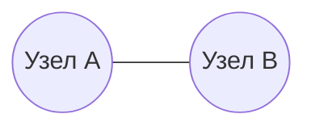
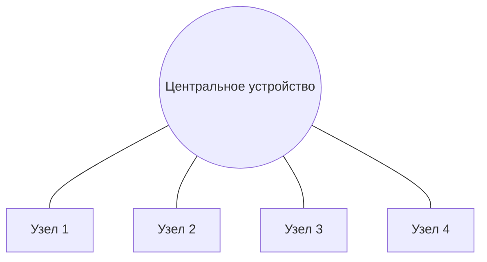
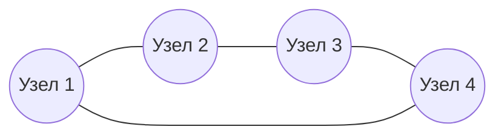
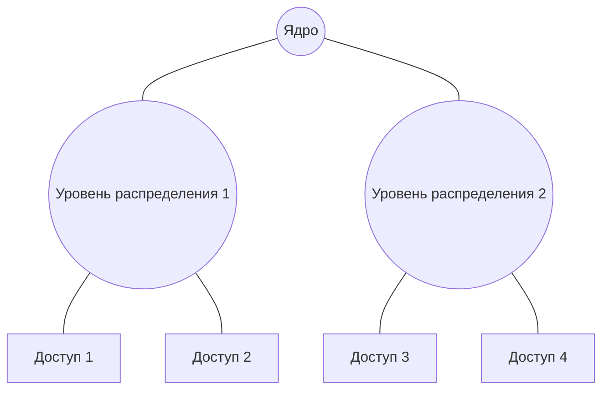
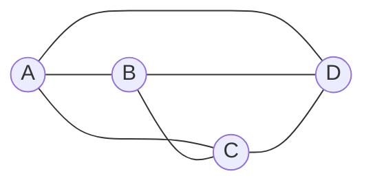
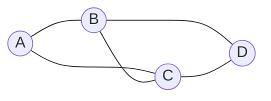
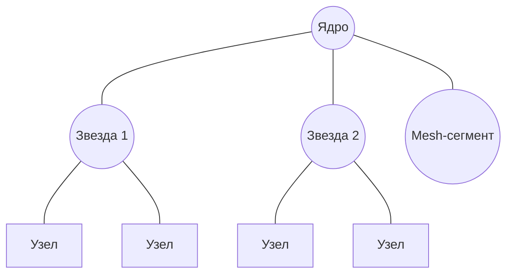

> [!info] Главная мысль  
> Топология — это не просто рисунок «кто с кем соединён». Это набор свойств, которые определяют:
> 
> - стоимость и сложность сети;
>     
> - отказоустойчивость;
>     
> - масштабируемость;
>     
> - задержки и пропускную способность;
>     
> - количество доменов коллизий;
>     
> - удобство эксплуатации и поиска неисправностей.
>     

### Что такое топология

**Топология сети** — это способ организации связей между узлами сети. Важно разделять два уровня:

#### Физическая топология

Это то, как реально проложены кабели, как расположены устройства, в какие порты они включены.

Пример:
- все компьютеры подключены к одному коммутатору в центре;
- между зданиями проложено кольцо оптоволокна;
- в серверной стойке каждый сервер подключён к двум разным коммутаторам.

#### Логическая топология

Это то, как данные реально передаются между узлами, кто с кем может общаться напрямую, где возникают общие среды и домены коллизий.

Пример:
- физически — звезда, но внутри стоит хаб, значит логически это общая шина;
- физически — звезда, но внутри коммутатор, значит логически каждый порт — отдельный сегмент точка-точка;

> [!important] Ключевая мысль  
> Одна и та же физическая топология может иметь разную логическую топологию. Именно логика определяет, как ведут себя коллизии, broadcast и пути трафика.

### Базовые виды топологий

#### Точка-точка / Point-to-point / P2P

Два устройства соединены напрямую.


**Плюсы:**
- максимально просто;
- вся пропускная способность канала доступна только двум узлам;
- нет коллизий, если работает full-duplex;
- легко обеспечивать безопасность и QoS.

**Минусы:**
- плохо масштабируется;
- нет встроенной отказоустойчивости, если линк один.

**Где встречается:**
- WAN-линки между офисами;
- serial-соединения;
- оптика между зданиями;
- туннели;
- соединение сервера с коммутатором;
- порт коммутатора — это всегда линк точка-точка.

> [!note] Современный Ethernet  
> В современном Ethernet каждый порт коммутатора — это отдельный линк точка-точка. Поэтому на коммутируемых сетях коллизий в нормальном режиме уже нет.

#### Шина / Bus

Все устройства подключены к одному общему кабелю — шине. На концах шины стоят терминаторы, которые поглощают сигнал и не дают ему отражаться.

![[images.png|480]]

Терминатор в топологии «шина» — это небольшой резистор (или согласующее устройство), которое устанавливается на физических концах кабеля-магистрали для поглощения электрического сигнала и предотвращения его отражения

**Как работает:**
- среда общая;
- если один узел передаёт, сигнал идёт по всей шине;
- все узлы слышат передачу;
- используется метод доступа **CSMA/CD**;
- если два узла начали передачу одновременно — возникает коллизия

**Плюсы:**
- минимум кабеля;
- дешевизна;
- простота для маленьких сетей.

**Минусы:**
- обрыв шины ломает всю сеть;
- все узлы делят одну пропускную способность;
- коллизии растут с числом узлов;
- сложно локализовать неисправность;
- плохая масштабируемость.

>[!warning] Домен коллизий  
В шине весь сегмент — один домен коллизий. Чем больше узлов, тем хуже.

#### Звезда / Star

Все узлы подключены к центральному устройству: хабу, коммутатору или точке доступа.



**Вариант с хабом:**
- физическая топология — звезда;
- логическая топология — общая шина;
- все порты хаба — один домен коллизий;
- данные повторяются на все порты.

**Вариант с коммутатором:**
- физическая топология — звезда;
- логически каждый порт — отдельный сегмент точка-точка;
- коммутатор принимает решение, на какой порт отправить кадр;
- коллизий нет, если работает full-duplex;
- каждый порт — отдельный домен коллизий.

**Плюсы:**
- легко подключать и отключать узлы;
- неисправность одного кабеля не ломает всю сеть;
- удобно искать проблемы;
- хорошо масштабируется;
- современные LAN почти всегда физическая звезда или дерево.

**Минусы:**
- центральное устройство — точка отказа;
- нужно больше кабеля, чем в шине;
- при выходе из строя центрального коммутатора без резервирования страдает вся звезда.

>[!important] Звезда и коммутатор  
В современной сети звезда — это не «общая среда», а центральная точка агрегации. Логически трафик идёт от узла к коммутатору и только потом к получателю.

### Кольцо / Ring

Каждый узел соединён с двумя соседями, образуя замкнутое кольцо.


**Как работает:**
- данные передаются по кольцу в одном или двух направлениях;
- в Token Ring используется маркер: передавать может только тот, у кого маркер;
- в FDDI часто используется двойное кольцо для отказоустойчивости.

**Плюсы:**
- детерминированный доступ;
- нет коллизий при маркерном методе;
- предсказуемая задержка;
- двойное кольцо даёт устойчивость к обрыву одного участка.

**Минусы:**
- разрыв одиночного кольца ломает сеть;
- добавление узла может требовать остановки кольца;
- сложнее эксплуатация;
- задержка растёт с числом узлов;
- сегодня в LAN почти не используется.


> [!note] Логическое кольцо  
> Кольцо может быть логическим: физически звезда, но маркер передаётся по кругу через центральное устройство.

### Дерево / Tree / Иерархическая звезда

Это комбинация нескольких звёзд, соединённых иерархически.



**Уровни:**
- **Core** — ядро, высокая скорость, минимальная задержка;
- **Distribution** — распределение, политики, маршрутизация между VLAN;
- **Access** — доступ, подключение конечных устройств.

**Плюсы:**
- хорошо масштабируется;
- структурируется;
- удобно применять политики;
- легко расширять.

**Минусы:**
- зависимость от верхних уровней;
- нужна redundancy на ядре и распределении;
- сложнее, чем одна звезда.

#### Ячеистая топология / Mesh

В ячеистой топологии узлы соединены множеством связей.

##### Полная mesh / Full mesh

Каждый узел соединён с каждым.



**Формула числа линков:**

```
N×(N−1)/2
```

Для 4 узлов: 6 линков. Для 10 узлов: 45 линков. Для 100 узлов: 4950 линков.

**Плюсы:**
- максимальная отказоустойчивость;
- нет единой точки отказа;
- кратчайшие пути;
- предсказуемая задержка.

**Минусы:**
- очень дорого;
- сложно проектировать;
- много портов;
- сложная маршрутизация.

##### Частичная mesh / Partial mesh

Не все узлы соединены напрямую, но есть несколько альтернативных путей.



**Плюсы:**
- компромисс между стоимостью и отказоустойчивостью;
- часто используется в WAN и ЦОД.

**Минусы:**
- сложнее, чем звезда;
- нужно проектировать маршрутизацию и резервирование.

#### Гибридная топология / Hybrid

Это комбинация разных топологий.



**Реальность:**
- почти любая современная сеть — гибридная;
- на уровне доступа — звезда;
- между зданиями — кольцо или mesh;
- в ЦОД — leaf-spine;
- в WAN — hub-and-spoke или partial mesh.

**Плюсы:**
- можно оптимизировать под задачу;
- гибкость;
- сочетание стоимости и надёжности.

**Минусы:**
- сложнее документировать;
- сложнее troubleshooting;
- нужна дисциплина проектирования.

### Сравнительная таблица

|Топология|Стоимость|Отказоустойчивость|Масштабируемость|Домен коллизий|Современность|
|---|---|---|---|---|---|
|Точка-точка|Низкая/средняя|Зависит от резерва|Плохая для N узлов|Нет|Очень актуальна|
|Шина|Низкая|Очень низкая|Очень плохая|Весь сегмент|Устарела|
|Звезда|Средняя|Средняя|Хорошая|С хабом — весь, с коммутатором — порт|Актуальна|
|Кольцо|Средняя|Средняя/высокая при dual ring|Средняя|Нет при маркере|Почти устарела в LAN|
|Дерево|Средняя/высокая|Зависит от резерва|Очень хорошая|Зависит от устройств|Актуальна|
|Full mesh|Очень высокая|Очень высокая|Плохая из-за O(N²)|Нет|Только для ядра/WAN|
|Partial mesh|Высокая|Высокая|Хорошая|Нет|Актуальна|
|Hub-and-spoke|Низкая/средняя|Низкая без резерва|Хорошая|Нет|Актуальна в WAN|
|Гибрид|Разная|Разная|Разная|Разная|Реальность|
