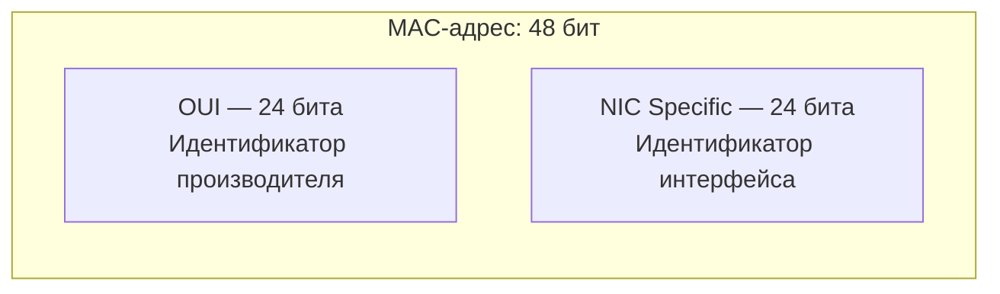
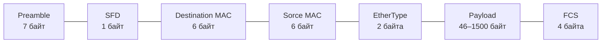
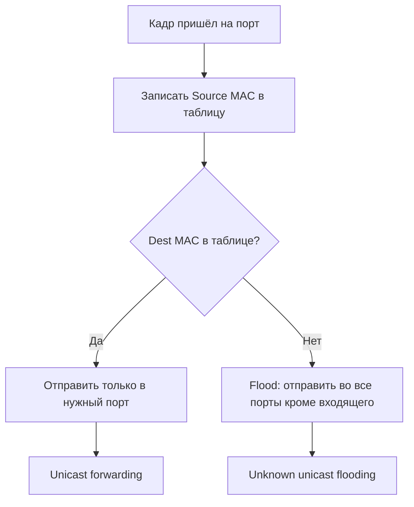
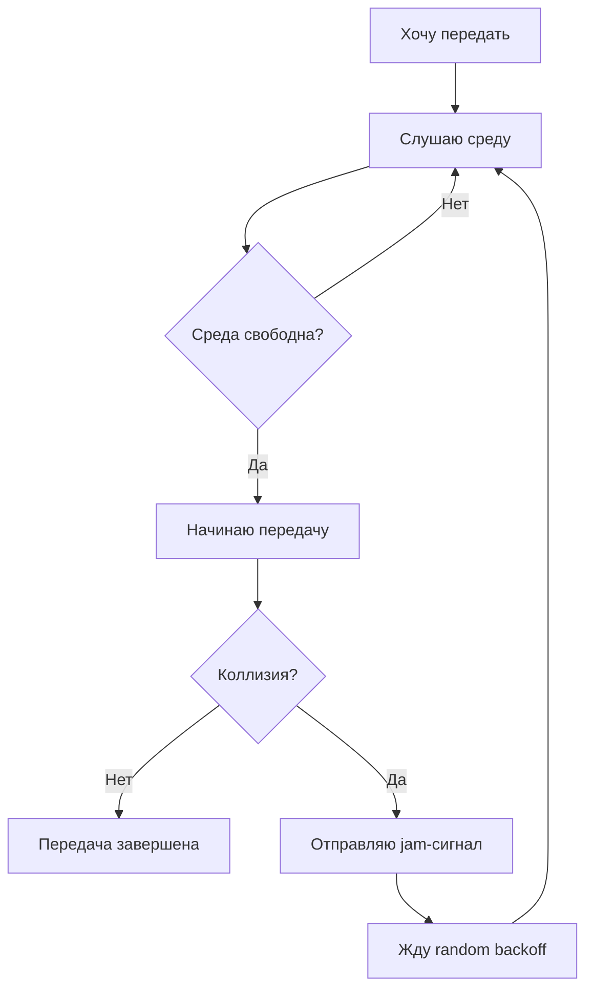
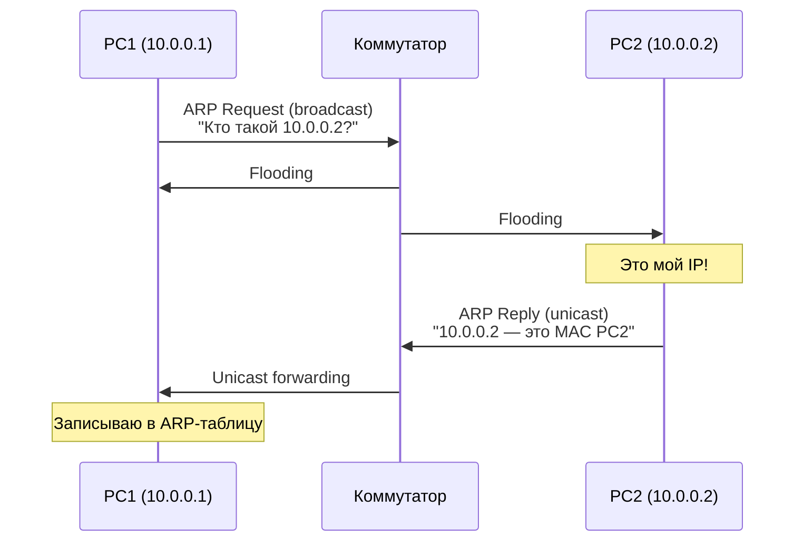

### MAC адрес

>[!info] Главная мысль  
MAC-адрес — это **физический адрес устройства на L2 уровне**, который идентифицирует сетевой интерфейс внутри одного **широковещательного домена**. Он не маршрутизируется между сетями и не имеет иерархии, как IP. Именно на MAC-адресах работает коммутация внутри локальной сети.

#### Что такое MAC-адрес

**MAC (Media Access Control) address** — уникальный идентификатор, присвоенный сетевому интерфейсу (NIC — Network Interface Card) на канальном уровне модели OSI (L2).

**Ключевые свойства:**
- Длина — **48 бит** (6 байт) в классическом Ethernet.
- Является **плоским** (flat) адресом — не содержит информации о местоположении в сети.
- Используется внутри **одного L2-сегмента** (broadcast-домена).
- Не меняется при перемещении устройства между сетями (в отличие от IP).
- Может быть **изменён программно** (MAC spoofing).

> [!important] MAC vs IP  
> MAC — это «кто ты» на уровне железа, IP — «где ты» на уровне сети. MAC работает внутри одного сегмента, IP — между сетями через маршрутизаторы.

#### Структура MAC-адреса

MAC-адрес состоит из **48 бит**, которые делятся на две части:



##### OUI — Organizationally Unique Identifier (24 бита)

- Первые 24 бита.
- Выдаётся производителю организацией **IEEE**.
- Уникален для каждого производителя.
- Примеры:
    - `00:1A:2B` — Cisco
    - `00:50:56` — VMware
    - `08:00:27` — VirtualBox
    - `B8:27:EB` — Raspberry Pi Foundation
    - `AC:DE:48` — приватный OUI (RFC 9542)

##### NIC Specific (24 бита)

- Последние 24 бита.
- Производитель сам назначает этот идентификатор каждому своему интерфейсу.
- Теоретически должен быть уникален.

**Итого:** 224×224=248224×224=248 ≈ 281 триллион возможных адресов.

> [!note] Регистр  
> Обычно пишут в нижнем регистре, но регистр не имеет значения. `00:1A:2B` = `00:1a:2b`.

#### Специальные биты

В первом байте MAC-адреса есть два важных бита:

| Бит | Название               | Значение                                           |
| --- | ---------------------- | -------------------------------------------------- |
| 0   | I/G — Individual/Group | 0 = unicast, 1 = multicast/broadcast               |
| 1   | U/L — Universal/Local  | 0 = глобально уникальный, 1 = локально назначенный |

Пример:
- `00:1A:2B:3C:4D:5E` — первый байт `00` = `0000 0000`. I/G = 0, U/L = 0. Обычный глобальный unicast.
- `01:00:5E:...` — первый байт `01` = `0000 0001`. I/G = 1. Это multicast.
- `FF:FF:FF:FF:FF:FF` — broadcast. Все биты = 1.

#### Типы MAC-адресов

##### Unicast
- Адрес конкретного интерфейса.
- I/G = 0.
- Пример: `00:1A:2B:3C:4D:5E`.

##### Multicast
- Адрес группы интерфейсов.
- I/G = 1.
- Диапазон: `01:00:5E:00:00:00` — `01:00:5E:7F:FF:FF` для IPv4 multicast.
- Пример: `01:00:5E:0A:0A:0A` для группы 224.10.10.10.

##### Broadcast
- Адрес всех интерфейсов в broadcast-домене.
- `FF:FF:FF:FF:FF:FF`.
- I/G = 1, все биты = 1.
#### Специальные MAC-адреса

|MAC|Назначение|
|---|---|
|`FF:FF:FF:FF:FF:FF`|Broadcast|
|`01:00:5E:00:00:01`|IPv4 multicast — All Hosts|
|`01:00:5E:00:00:02`|IPv4 multicast — All Routers|
|`01:80:C2:00:00:00`|STP BPDU|
|`01:80:C2:00:00:0E`|LLDP|
|`33:33:xx:xx:xx:xx`|IPv6 multicast|
|`00:00:00:00:00:00`|Не используется / неизвестен|
|`00:00:5E:00:01:xx`|VRRP|
|`01:00:5E:00:00:05`|OSPF All Routers|
|`01:00:5E:00:00:06`|OSPF All DR Routers|

> [!note] IPv6 multicast  
> В IPv6 multicast MAC начинается с `33:33` и формируется из последних 32 бит multicast IPv6-адреса.

#### Как MAC используется в сети

##### На уровне Ethernet-кадра

Ethernet-кадр (L2) содержит:


- **Destination MAC** — кому адресован кадр.
- **Source MAC** — от кого.
- Коммутатор читает **Destination MAC** и решает, куда отправить кадр.

### Кадр Ethernet

Структура Ethernet кадра 



| Поле            | Размер       | Назначение                                              |
| --------------- | ------------ | ------------------------------------------------------- |
| Preamble        | 7 байт       | Данные для синхронизации приёмника                      |
| SFD             | 1 байт       | Начало кадра                                            |
| Destination MAC | 6 байт       | Кому адресован кадр                                     |
| Source MAC      | 6 байт       | От кого исходит кадр                                    |
| EtherType       | 2 байта      | Что внутри (0x0800 = IPv4, 0x0806 = ARP, 0x86DD = IPv6) |
| Payload         | 46–1500 байт | Полезные данные                                         |
| FCS             | 4 байта      | CRC-проверка целостности                                |
>[!important] Минимальный и максимальный размер  
Минимальный кадр — 64 байта (без preamble). Максимальный — 1518 байт (без preamble и VLAN-тега). С VLAN-тегом — 1522 байта.

#### Что коммутатор читает из кадра

Коммутатор смотрит на:

- **Source MAC** — чтобы запомнить, откуда пришёл кадр.
- **Destination MAC** — чтобы решить, куда его отправить.

Он **не смотрит** на IP-адреса. Это принципиально

### Коммутатор

**Коммутатор** (switch) — устройство канального уровня (L2), которое:
- принимает кадры на порты;
- изучает MAC-адреса источников;
- строит таблицу MAC-адресов (CAM-таблицу);
- принимает решение о движении кадра по конкретному порту.

#### Отличие от хаба

|Свойство|Хаб|Коммутатор|
|---|---|---|
|Уровень|L1|L2|
|Домен коллизий|Один на все порты|Каждый порт отдельно|
|Домен broadcast|Один|Один (без VLAN)|
|Логика|Повторяет сигнал во все порты|Решает, куда отправить|
|Duplex|Half-duplex|Full-duplex возможен|
|Пропускная способность|Делится между всеми|Каждый порт — отдельная|

> [!important] Ключевое отличие  
> Хаб — это электрический повторитель. Коммутатор — это интеллектуальное устройство с таблицей MAC-адресов.

#### Таблица соответствий

**Content-Addressable Memory** — это специальная память, в которой коммутатор хранит соответствие:

```
MAC-адрес          →  Порт    →  Возраст (aging)
00:1A:2B:3C:4D:5E  →  Gi0/1   →  120 сек
00:1A:2B:3C:4D:5F  →  Gi0/2   →  45 сек
```

**Aging time** — обычно 300 секунд (5 минут) в Cisco. Если запись не обновляется, она удаляется.

**Размер таблицы:**

- Access коммутаторы: 8K–16K записей.
- Коммутаторы ЦОД: 32K–128K и больше.

#### Как коммутатор заполняет таблицу

Коммутатор работает по принципу **store-and-forward** (в большинстве случаев):

1. Принимает кадр на порт.
2. Читает **Source MAC**.
3. Записывает в таблицу соответствий: `Source MAC → порт, откуда пришёл кадр`.
4. Читает **Dest MAC**.
5. Ищет Dest MAC в CAM-таблице.
6. Принимает решение.

> [!note] Source MAC learning  
> Коммутатор всегда запоминает отправителя. Это называется **learning**. Именно так таблица наполняется автоматически.

#### Алгоритм коммутации



Три режима:

| Режим                  | Условие                                 | Действие                                |
| ---------------------- | --------------------------------------- | --------------------------------------- |
| **Unicast forwarding** | Dest MAC известен                       | Отправить в конкретный порт             |
| **Flooding**           | Dest MAC неизвестен                     | Отправить во все порты, кроме входящего |
| **Filtering**          | Dest MAC на том же порту, откуда пришёл | Отбросить кадр                          |

#### Broadcast и multicast в коммутаторе

- **Broadcast** (`FF:FF:FF:FF:FF:FF`) — всегда flooding во все порты в рамках VLAN.
- **Multicast** — если нет IGMP snooping, тоже flooding. С IGMP snooping — только в порты, где есть подписчики.
- **Unknown unicast** — flooding, пока не выучится.

> [!warning] Лавина broadcast  
> Если в сети есть петля, broadcast будет ходить по кругу бесконечно. Поэтому нужен **STP** (Spanning Tree Protocol).

### Коммутация

#### Что такое коммутация

**Коммутация** — это процесс направления кадров внутри коммутатора на основе MAC-адресов.

Коммутация бывает:
- **L2-коммутация** — по MAC-адресам.
- **L3-коммутация** — по IP-адресам (маршрутизация на коммутаторе).
- **L4-коммутация** — по портам TCP/UDP (балансировка).

#### Типы коммутации по способу обработки кадра

##### Store-and-forward
- Коммутатор принимает **весь кадр**.
- Проверяет FCS.
- Только потом отправляет.
- **Плюс:** отбрасывает битые кадры.
- **Минус:** задержка = время приёма всего кадра.
- **Современный стандарт.**

##### Cut-through
- Коммутатор читает только первые 6 байт (Dest MAC).
- Сразу начинает передавать.
- **Плюс:** минимальная задержка.
- **Минус:** пропускает битые кадры.
- Используется в ЦОД и HPC.

##### Fragment-free
- Читает первые 64 байта.
- Компромисс между store-and-forward и cut-through.
- Устарел.

#### Таблица коммутации vs таблица маршрутизации

|Свойство|CAM (L2)|Routing table (L3)|
|---|---|---|
|Ключ|MAC-адрес|IP-адрес|
|Уровень|L2|L3|
|Заполнение|Автоматически (learning)|Вручную или протоколами|
|Размер|Тысячи|Тысячи–миллионы|
|Область|Broadcast-домен|Между сетями|

> [!important] Коммутатор не «маршрутизирует»  
> Обычный L2-коммутатор не может передать кадр между разными IP-подсетями. Для этого нужен маршрутизатор или L3-коммутатор.

### Домен коллизий

**Домен коллизий** — это область сети, в которой кадры могут столкнуться (collision). Коллизия возникает, когда два устройства одновременно начинают передачу в общей среде.

- **Хаб** — все порты в одном домене коллизий.
- **Коммутатор** — каждый порт — отдельный домен коллизий.
- **Точка-точка full-duplex** — коллизий нет.
- **Шина** — вся шина — один домен коллизий.
- **Wi-Fi** — все клиенты на одном канале — один домен коллизий (CSMA/CA).

#### CSMA/CD

**Carrier Sense Multiple Access with Collision Detection** — метод доступа, использовавшийся в Ethernet с общей средой.



**Почему это важно:**

- в современном коммутируемом Ethernet с full-duplex CSMA/CD **не используется**;
- но понимание CSMA/CD нужно для экзаменов и для понимания Wi-Fi (там CSMA/CA).

#### Влияние на производительность

- Чем больше домен коллизий, тем больше коллизий.
- Чем больше коллизий, тем ниже реальная пропускная способность.
- Коммутатор разбивает домен коллизий на порты, поэтому производительность растёт.

> [!tip] Правило  
> Коммутатор = много доменов коллизий. Хаб = один домен коллизий.

### Широковещательный домен

**Broadcast-домен** — это область сети, в которой broadcast-кадр (Dest MAC = `FF:FF:FF:FF:FF:FF`) распространяется без препятствий.

#### Что ограничивает broadcast-домен

- **Маршрутизатор** — не пропускает broadcast по умолчанию.
- **VLAN** — логически разделяет коммутатор на несколько broadcast-доменов.
- **Коммутатор** — не ограничивает broadcast, а распространяет его во все порты в рамках VLAN.

#### Размер broadcast-домена

- Слишком большой broadcast-домен → много broadcast-трафика → нагрузка на CPU конечных устройств.
- Слишком маленький → много подсетей → сложнее管理.
- Типично: 200–500 устройств на broadcast-домен.

#### Broadcast-шторм

Если в сети есть петля L2, broadcast-кадры начинают ходить по кругу. **Решение:** STP (Spanning Tree Protocol) — блокирует избыточные линки.

### Широковещательный запрос

#### Что это

**Broadcast-запрос** — это кадр, отправленный на `FF:FF:FF:FF:FF:FF`. Его получают **все** устройства в broadcast-домене.

#### Зачем нужен

- **ARP** — узнать MAC по IP.
- **DHCP Discover** — найти DHCP-сервер.
- **NetBIOS Name Service** — разрешение имён.
- **mDNS** — мультикаст, но работает похоже.

#### Как обрабатывается

- **Коммутатор** — flooding во все порты в VLAN.
- **Маршрутизатор** — не пропускает (по умолчанию).
- **Конечное устройство** — обрабатывает, если это его касается.

> [!warning] Broadcast — это нормально, но в меру  
> 5–10% broadcast-трафика — норма. Больше — повод искать проблему.

### ARP-запрос

#### Что такое ARP

**ARP** (Address Resolution Protocol) — протокол, который связывает IP-адрес (L3) с MAC-адресом (L2).

**Зачем:** чтобы отправить IP-пакет, нужно знать, какому MAC его адресовать.

#### Как работает ARP


####  ARP-таблица

Каждое устройство хранит ARP-таблицу:

```
IP-адрес       MAC-адрес            Тип
10.0.0.2       00:1A:2B:3C:4D:5E    Dynamic
10.0.0.1       00:1A:2B:3C:4D:5F    Dynamic
192.168.1.1    00:1A:2B:3C:4D:60    Static
```

- **Dynamic** — выучено через ARP, живёт ~4 часа.
- **Static** — задано вручную, не стареет.

#### ARP и broadcast-домен

ARP Request — это broadcast. Поэтому он **не выходит за пределы broadcast-домена**.

Если PC1 (10.0.0.1) хочет обратиться к PC в другой подсети (10.0.1.1):

- PC1 не делает ARP для 10.0.1.1;
- PC1 делает ARP для **шлюза** (например, 10.0.0.254);
- и отправляет пакет на MAC шлюза.

> [!important] Ключевое правило  
> ARP работает только внутри одной подсети. Для связи между подсетями нужен маршрутизатор (шлюз).

#### ARP и коммутатор

Коммутатор **не понимает ARP**. Он видит только:

- Dest MAC = `FF:FF:FF:FF:FF:FF` → flooding.
- Dest MAC = конкретный → unicast forwarding.

Но коммутатор **учится** на ARP-кадрах:

- Source MAC ARP-запроса → записывается в CAM.
- Source MAC ARP-ответа → тоже записывается.

#### Опасности ARP

##### ARP spoofing

Атакующий отправляет ложные ARP-ответы и подменяет MAC шлюза.
**Защита:**
- Dynamic ARP Inspection (DAI);
- статические ARP-записи;
- DHCP snooping.

#### ARP flooding

Много ARP-запросов → нагрузка на CPU.
**Защита:**
- rate limiting на коммутаторе;
- разделение на VLAN.