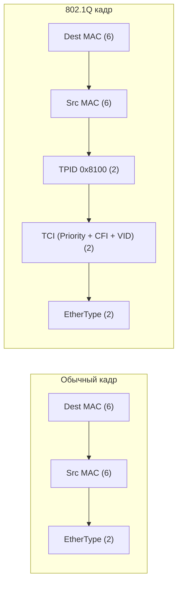

### VLAN (Virtual Local Area Network)

> [!info] Главная мысль  
> VLAN — это **логическое разделение** одного физического коммутатора (или группы коммутаторов) на несколько изолированных широковещательных доменов. Это как разделить одно большое здание на этажи с отдельными домофонами: физически стены общие, но жители одного этажа не слышат соседей с другого.

#### Зачем нужны VLAN

1. **Безопасность:** Изоляция трафика (например, VLAN для бухгалтерии отдельно от VLAN для гостей).
2. **Снижение broadcast-трафика:** Broadcast-кадр не выходит за пределы своего VLAN.
3. **Гибкость:** Пользователя можно перенести в другой отдел (другой VLAN) без переключения физического кабеля, просто изменив конфигурацию порта.

#### Стандарт 802.1Q

Для передачи трафика нескольких VLAN между коммутаторами используется стандарт **IEEE 802.1Q**. Он добавляет в Ethernet-кадр специальную **VLAN-метку (tag)** размером 4 байта.

