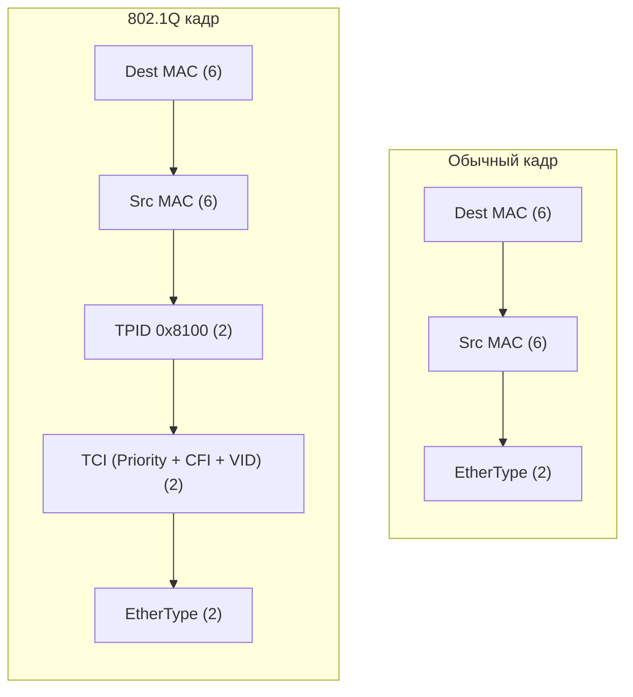

## VLAN (Virtual Local Area Network)

> [!info] Главная мысль  
> VLAN — это **логическое разделение** одного физического коммутатора (или группы коммутаторов) на несколько изолированных широковещательных доменов. Это как разделить одно большое здание на этажи с отдельными домофонами: физически стены общие, но жители одного этажа не слышат соседей с другого.

### Зачем нужны VLAN

1. **Безопасность:** Изоляция трафика (например, VLAN для бухгалтерии отдельно от VLAN для гостей).
2. **Снижение broadcast-трафика:** Broadcast-кадр не выходит за пределы своего VLAN.
3. **Гибкость:** Пользователя можно перенести в другой отдел (другой VLAN) без переключения физического кабеля, просто изменив конфигурацию порта.

### Стандарт 802.1Q

Для передачи трафика нескольких VLAN между коммутаторами используется стандарт **IEEE 802.1Q**. Он добавляет в Ethernet-кадр специальную **VLAN-метку (tag)** размером 4 байта.

- **TPID (Tag Protocol Identifier):** `0x8100` (сигнализирует, что это тегированный кадр).
- **VID (VLAN ID):** 12 бит, что дает **4096** возможных VLAN (0 и 4095 зарезервированы, usable: 1–4094).

## Типы портов коммутатора: Access и Trunk

Порты коммутатора настраиваются в зависимости от того, что к ним подключено.

### Access Port (Порт доступа)

- **Куда подключается:** Конечные устройства (ПК, принтеры, серверы, точки доступа Wi-Fi).
- **Поведение:**
    - Приём: Принимает **нетегированные** (untagged) кадры и назначает им VLAN по умолчанию (PVID, обычно VLAN 1).
    - Передача: **Снимает тег** (untag) перед отправкой кадра устройству, так как обычные сетевые карты не понимают 802.1Q.
- **Правило:** Принадлежит только **одному** VLAN.

#### Trunk Port (Магистральный порт)

- **Куда подключается:** Другие коммутаторы, маршрутизаторы (Router-on-a-Stick), серверы с поддержкой VLAN (например, гипервизоры).
- **Поведение:**
    - Приём/Передача: Передает кадры **с тегами** (tagged), чтобы принимающая сторона знала, к какому VLAN относится кадр.
- **Native VLAN (Родной VLAN):** Особый VLAN на транке, кадры которого передаются **без тега**. По умолчанию это VLAN 1.
    
> [!warning] Безопасность Native VLAN      > Злоумышленник может использовать атаку "VLAN Hopping" (двойное тегирование), если Native VLAN на транке совпадает с VLAN, к которому у него есть доступ. **Best Practice:** Назначить неиспользуемый VLAN (например, 999) как Native и не использовать его для данных.