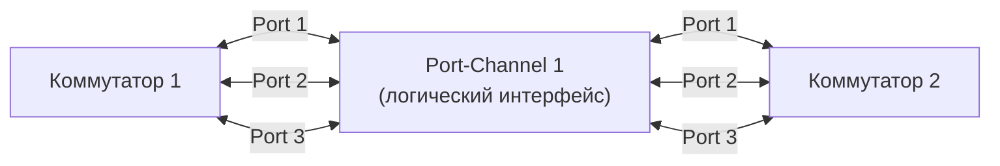

## VLAN (Virtual Local Area Network)

> [!info] Главная мысль  
> VLAN — это способ **логически** разделить один физический коммутатор на несколько независимых устройств. Представь, что у тебя есть один большой дом, и ты хочешь, чтобы жильцы первого этажа не слышали жильцов второго. Ты ставишь звукоизоляцию — физически дом тот же, но теперь это как два разных дома. VLAN делает то же самое с сетью.

### Зачем это нужно

Без VLAN все порты коммутатора находятся в **одном широковещательном домене**. Это значит:

- Любой broadcast-кадр (ARP-запрос, DHCP Discover) получает **каждое устройство** в сети.
- Если в сети 1000 устройств, каждое получает тысячи broadcast-кадров в секунду и тратит CPU на их обработку.
- Любой пользователь может "подслушать" трафик другого пользователя.

VLAN решает все три проблемы:

1. **Broadcast ограничивается VLAN.** ARP-запрос из VLAN 10 никогда не попадёт в VLAN 20.
2. **Изоляция.** Устройства из разных VLAN не видят друг друга на L2. Чтобы они могли общаться, нужен маршрутизатор (L3).
3. **Гибкость.** Пользователя можно "переселить" в другой отдел, не переключая кабель — достаточно поменять VLAN на порту.

### Как устроен VLAN внутри коммутатора

Когда коммутатор получает кадр на порт, он смотрит не только на MAC-адреса, но и на **номер VLAN**, к которому относится этот порт. У каждого порта есть параметр **PVID (Port VLAN ID)** — "родной" VLAN порта.

```
Порт Gi0/1 → PVID = 10
Порт Gi0/2 → PVID = 10
Порт Gi0/3 → PVID = 20
Порт Gi0/4 → PVID = 20
```

Внутри коммутатора для каждого VLAN ведётся **своя таблица MAC-адресов**. То есть один и тот же MAC-адрес `00:11:22:33:44:55` может одновременно быть в таблице для VLAN 10 (на порту Gi0/1) и для VLAN 20 (на порту Gi0/3) — и это **разные устройства** (или одно устройство, подключенное к двум VLAN, что редкость).

### Стандарт IEEE 802.1Q

Когда нужно передать трафик нескольких VLAN между коммутаторами, в Ethernet-кадр вставляется специальная **метка (tag)** размером 4 байта. Она вставляется между Source MAC и EtherType.


- **TPID (Tag Protocol Identifier):** `0x8100` (сигнализирует, что это тегированный кадр).
- **VID (VLAN ID):** 12 бит, что дает **4096** возможных VLAN (0 и 4095 зарезервированы, можно использовать: 1–4094).

> [!important] Что значит "тегированный" и "нетегированный" кадр
> 
> - **Tagged frame** — кадр с 802.1Q-тегом. Принимающая сторона знает, к какому VLAN он относится, по VID.
> - **Untagged frame** — обычный Ethernet-кадр без тега. Принимающая сторона назначает ему VLAN по умолчанию (PVID порта).

## Access Port (порт доступа)

> [!info] Главная мысль  
> Access-порт — это порт для **конечных устройств**, которые ничего не знают о VLAN. Он принадлежит **только одному VLAN** и работает с нетегированными кадрами.

### Что происходит при приёме кадра

1. ПК отправляет обычный Ethernet-кадр (без тега).
2. Кадр приходит на Access-порт.
3. Коммутатор смотрит на **PVID порта** (например, VLAN 10).
4. Коммутатор **внутренне** помечает кадр как принадлежащий VLAN 10.
5. Дальше коммутатор работает с этим кадром как с обычным кадром VLAN 10: ищет MAC-адрес получателя в таблице **VLAN 10** и отправляет кадр дальше.

### Что происходит при передаче кадра

1. Коммутатор хочет отправить кадр из VLAN 10 на Access-порт.
2. Перед отправкой коммутатор **снимает тег** (если он был внутри коммутатора), потому что конечное устройство не понимает 802.1Q.
3. Кадр уходит в ПК как обычный нетегированный Ethernet-кадр.

> [!warning] Важное следствие  
> Access-порт **никогда** не отправляет теги в сеть. Если ты подключишь к Access-порту другой коммутатор, он не сможет различать VLAN — весь трафик будет относиться к PVID порта.

### Ограничения Access-порта

- Может принадлежать **только одному** VLAN.
- Не передаёт теги.
- Не может передавать трафик других VLAN.

## Trunk Port (магистральный порт)

> [!info] Главная мысль  
> Trunk-порт — это порт для **соединения сетевых устройств** между собой (коммутатор-коммутатор, коммутатор-маршрутизатор, коммутатор-сервер с виртуализацией). Он передаёт трафик **нескольких VLAN одновременно**, используя теги 802.1Q.

### Что происходит при приёме кадра

1. С другого коммутатора приходит кадр **с тегом** (например, VID = 20).
2. Trunk-порт читает VID из тега.
3. Коммутатор помечает кадр как принадлежащий VLAN 20.
4. Дальше кадр обрабатывается в рамках VLAN 20.

**Что если пришёл нетегированный кадр?**

- Коммутатор назначает ему **Native VLAN** (об этом ниже).

### Что происходит при передаче кадра

1. Коммутатор хочет отправить кадр из VLAN 20 на Trunk-порт.
2. Коммутатор проверяет: **VLAN 20 разрешён (allowed) на этом транке?**
    - Если да → добавляет тег 802.1Q с VID = 20 и отправляет.
    - Если нет → отбрасывает кадр.
3. **Исключение:** если VLAN 20 — это Native VLAN этого транка, тег **не добавляется** (кадр уходит нетегированным).

> [!note] Список разрешённых VLAN  
> На транке можно настроить, какие VLAN можно передавать. Например, разрешить только VLAN 10, 20, 30. Тогда кадр из VLAN 40, даже если он есть на коммутаторе, не пойдёт через этот транк. Это нужно для безопасности и экономии полосы пропускания.

#### Отличие Access от Trunk — сводная таблица

| Свойство                    | Access Port                        | Trunk Port                                |
| --------------------------- | ---------------------------------- | ----------------------------------------- |
| Для чего                    | Конечные устройства (ПК, принтеры) | Сетевые устройства (коммутаторы, роутеры) |
| Количество VLAN             | Один (PVID)                        | Много (список allowed VLAN)               |
| Приём нетегированных кадров | Назначает PVID                     | Назначает Native VLAN                     |
| Приём тегированных кадров   | Обычно отбрасывает                 | Читает VID из тега                        |
| Передача кадров             | Всегда без тега                    | С тегом (кроме Native VLAN)               |

## Native VLAN (родной VLAN)

> [!info] Главная мысль  
> Native VLAN — это VLAN, кадры которого на Trunk-порту передаются **без тега**. По умолчанию это VLAN 1.

### Зачем он нужен

Не все устройства понимают 802.1Q. Например, старый коммутатор или специфическое сетевое оборудование. Чтобы оно могло обмениваться служебным трафиком через транк, нужен "общий язык" — нетегированный трафик. Это и есть Native VLAN.

### Что важно знать

1. **По умолчанию Native VLAN = VLAN 1.** Это **небезопасно**, потому что VLAN 1 часто используется для атак (VLAN hopping).
2. **Native VLAN должен совпадать на обоих концах транка.** Если на одном коммутаторе Native = 10, а на другом Native = 20, они не смогут обмениваться нетегированным трафиком.
3. **Best Practice:** назначить неиспользуемый VLAN (например, 999) как Native и не использовать его для пользовательских данных.

> [!warning] Опасность несоответствия Native VLAN  
> Если Native VLAN не совпадает на концах транка, ты получишь странные проблемы: часть трафика ходит, часть нет, CDP/LLDP не работают, STP может вести себя непредсказуемо. Это одна из самых частых причин "магических" проблем в L2-сетях.

## STP (Spanning Tree Protocol)

> [!info] Главная мысль  
> STP решает проблему **L2-петель**. В Ethernet, в отличие от IP, нет счётчика TTL для кадров — если кадр попал в петлю, он будет ходить по кругу вечно, пока не будет отброшен из-за ошибки FCS или переполнения буфера. STP логически "разрывает" петлю, блокируя избыточные порты.

### Почему петли — это катастрофа

Представь, что у тебя два коммутатора соединены двумя кабелями для надёжности. Без STP:

1. **Broadcast-шторм.** ПК отправляет ARP-запрос (broadcast). Коммутатор A флудит его во все порты, включая линк к коммутатору B. Коммутатор B получает кадр и тоже флудит его во все порты, включая линк обратно к A. Кадр ходит по кругу, с каждым кругом размножаясь (потому что на каждом коммутаторе он флудится снова). За секунды сеть ложится.
2. **MAC flapping.** Один и тот же MAC-адрес виден на разных портах коммутатора. Коммутатор постоянно перезаписывает таблицу MAC-адресов, и в какой-то момент кадр может уйти не туда.
3. **Дублирование кадров.** Один и тот же кадр может прийти к получателю несколько раз.

### Как работает STP — основная идея

STP строит **дерево** (отсюда и название — Spanning Tree, "остовное дерево") — такую топологию, где между любыми двумя точками есть **только один путь**. Избыточные линки логически отключаются, но физически остаются. Если основной линк падает, STP пересчитывает дерево и активирует резервный.

### Ключевые роли в STP

#### 1. Root Bridge (корневой коммутатор)

В каждой сети STP выбирает **один** коммутатор, который становится "корнем" дерева. Все пути строятся относительно него.

**Как выбирается:**

- Каждый коммутатор имеет **Bridge ID** = Приоритет (16 бит, по умолчанию 32768) + MAC-адрес (48 бит).
- Побеждает коммутатор с **наименьшим Bridge ID**.
- Сначала сравнивается приоритет, при равенстве — MAC-адрес.

> [!note] Аналогия  
> Root Bridge — это как столица в стране. Все дороги (пути) строятся относительно столицы.

#### 2. Root Port (корневой порт)

На **каждом некорневом** коммутаторе выбирается **один** порт — тот, через который **стоимость пути до Root Bridge минимальна**.

**Стоимость пути (Cost)** зависит от скорости линка:

- 10 Gbps → Cost = 2
- 1 Gbps → Cost = 4
- 100 Mbps → Cost = 19
- 10 Mbps → Cost = 100

Если есть несколько путей с одинаковой стоимостью, выбирается тот, у которого:

- Меньше Bridge ID следующего коммутатора на пути.
- Меньше Port Priority следующего коммутатора.
- Меньше номер порта.

#### 3. Designated Port (назначенный порт)

На **каждом сегменте сети** (каждом "куске" кабеля между коммутаторами) выбирается **один** Designated Port — тот, который **ближе всего к Root Bridge** по стоимости пути. Именно этот порт будет пересылать трафик в этот сегмент.

#### 4. Non-Designated / Blocking Port

Все остальные порты, которые не стали ни Root Port, ни Designated Port, переходят в состояние **Blocking**. Они не пересылают пользовательский трафик, но слушают BPDU (служебные пакеты STP), чтобы знать о изменениях топологии.

### BPDU (Bridge Protocol Data Unit)

Это служебные пакеты, которыми коммутаторы обмениваются для работы STP. Они содержат:

- Root Bridge ID.
- Стоимость пути до Root.
- Bridge ID отправителя.
- Port ID отправителя.

BPDU отправляются каждые **2 секунды** (Hello Time). Если коммутатор не получает BPDU от соседа в течение определённого времени, он считает, что линк упал, и пересчитывает топологию.

### Состояния портов в классическом STP (802.1D)

|Состояние|Что делает порт|Длительность|
|---|---|---|
|**Disabled**|Административно выключен|—|
|**Blocking**|Не пересылает трафик, не учит MAC, только слушает BPDU|20 сек (Max Age)|
|**Listening**|Слушает BPDU, готовится стать DP или RP|15 сек (Forward Delay)|
|**Learning**|Учит MAC-адреса, но ещё не пересылает трафик|15 сек (Forward Delay)|
|**Forwarding**|Полноценная работа|—|

**Итого:** переход из Blocking в Forwarding занимает **30–50 секунд**. Это очень долго для современных сетей.

#### Почему так долго?

STP боится временных петель. Если порт сразу перейдёт в Forwarding, а в сети ещё есть петля, начнётся broadcast-шторм. Поэтому STP "перестраховывается":

1. 20 сек ждёт, чтобы убедиться, что старой топологии больше нет (Max Age).
2. 15 сек слушает BPDU, чтобы понять свою роль (Listening).
3. 15 сек учит MAC-адреса, чтобы таблица была готова (Learning).

#### RSTP (Rapid STP, 802.1w)

RSTP — это быстрая версия STP. Основные отличия:

- Сходится за **1–2 секунды** вместо 30–50.
- Убраны состояния Listening и Blocking — вместо них одно состояние **Discarding**.
- Добавлены роли портов: **Alternate** (резервный для Root Port) и **Backup** (резервный для Designated Port).
- Использует механизм **Proposal/Agreement** для быстрого перевода портов в Forwarding на точечных линках.

> [!tip] В современных сетях используется RSTP или MSTP (Multiple STP, 802.1s), а классический 802.1D — только для совместимости со старым оборудованием.

#### PortFast (Edge Port)

Если к порту подключено конечное устройство (ПК, сервер), нет смысла ждать 30 секунд, пока порт пройдёт все состояния STP. **PortFast** позволяет порту сразу перейти в Forwarding, пропустив Listening и Learning.

> [!warning] Опасность PortFast  
> Если включить PortFast на порту, к которому подключён другой коммутатор, можно создать петлю. Поэтому PortFast включают **только на Access-портах**, к которым подключены конечные устройства.


## Bond / EtherChannel (агрегация каналов)

> [!info] Главная мысль  
> Агрегация каналов объединяет несколько физических линков между двумя устройствами в **один логический канал**. Это решает сразу две проблемы: увеличивает пропускную способность и позволяет STP не блокировать избыточные линки.

### Зачем это нужно

**Проблема 1: STP блокирует избыточные линки.** Если ты соединил два коммутатора четырьмя кабелями для надёжности, STP заблокирует три из них, чтобы не было петли. В итоге ты платишь за четыре кабеля, а используешь один.

**Проблема 2: Ограничение скорости одного линка.** Даже если у тебя 10 Gbps порт, а трафика больше — ты упрёшься в потолок. Агрегация позволяет получить, например, 40 Gbps из четырёх линков по 10 Gbps.

**Решение:** агрегация. STP видит агрегированный канал как **один** логический порт. Если один из физических линков падает, трафик автоматически перераспределяется по оставшимся — без пересчёта STP и без разрыва сессий.

### Как это работает

Агрегация создаёт **логический интерфейс** (Port-Channel, Bond,LAG — Link Aggregation Group), который объединяет несколько физических портов.



Для коммутатора это выглядит как **один** порт с увеличенной пропускной способностью. STP работает с этим логическим портом, а не с физическими.

### Требования к агрегации

Чтобы агрегация работала корректно, все физические порты в группе должны быть **идентичны**:

- Одинаковая скорость (все 1 Gbps или все 10 Gbps).
- Одинаковый дуплекс (все full-duplex).
- Одинаковая настройка VLAN (одинаковые allowed VLAN, одинаковый Native VLAN).
- Одинаковая скорость и дуплекс.

Если хотя бы один порт отличается, он **не войдёт** в агрегацию и будет работать отдельно (или будет заблокирован, в зависимости от настроек).

### Балансировка нагрузки (Load Balancing)

> [!important] Ключевой момент  
> Агрегация **НЕ делит один поток данных** на части по разным кабелям. Балансировка работает **по потокам (per-flow)**.

**Почему не per-packet?** Если бы каждый пакет одного TCP-соединения шёл по разным кабелям, пакеты приходили бы в неправильном порядке (потому что разные кабели могут иметь разную задержку). TCP пришлось бы постоянно делать retransmit, и производительность упала бы.

**Как работает per-flow балансировка:** Коммутатор считает **хеш** от полей кадра: Src MAC, Dst MAC, Src IP, Dst IP, Src Port, Dst Port. Все пакеты одного потока (с одинаковыми полями) получают одинаковый хеш и идут по одному физическому линку. Разные потоки могут идти по разным линкам.