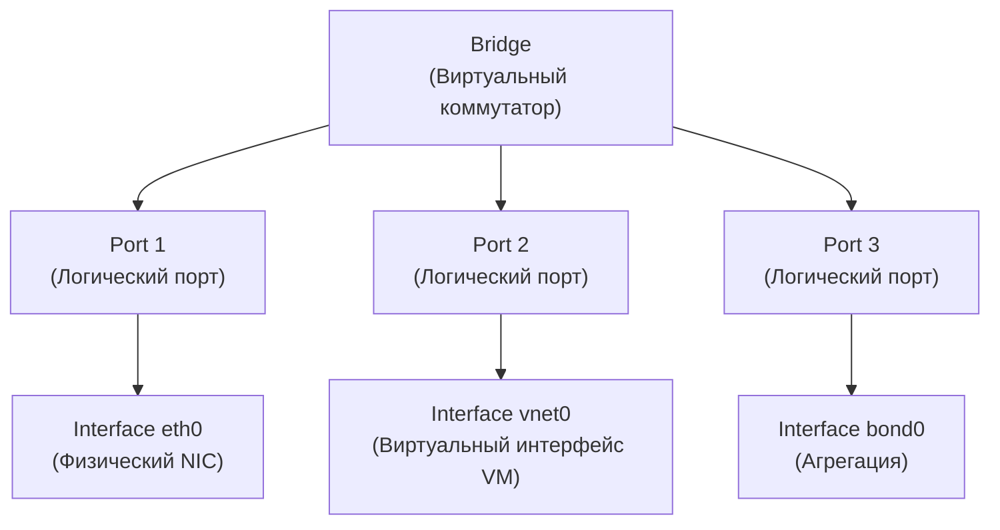

Open vSwitch — это **программный коммутатор** с открытым исходным кодом, который реализует функциональность L2-коммутатора в среде виртуализации и облачных инфраструктур. В отличие от физических коммутаторов, OVS работает внутри хоста (сервера) и позволяет создавать виртуальные сети, VLAN, агрегацию каналов и интегрироваться с системами оркестрации (Kubernetes, OpenStack) через протокол OpenFlow.

## Архитектура OVS: Bridge, Port, Interface

Это самая важная концепция, которую нужно понять. В OVS иерархия объектов отличается от физических коммутаторов.

## Bridge (мост)

Это **сам коммутатор**. Аналог физического коммутатора. У моста есть имя (например, `br0`, `br-int`, `br-ex`). К мосту подключаются порты. Мосту можно назначить IP-адрес — но не напрямую, а через **internal port** с тем же именем (об этом ниже).

## Port (порт)

Это **логический порт** коммутатора. К одному порту может быть привязан один или несколько интерфейсов. Именно на порте настраиваются VLAN-параметры (access/trunk), LACP, STP.

## Interface (интерфейс)

Это **конкретный сетевой интерфейс**, который "входит" в порт. Это может быть:

- Физический интерфейс (`eth0`, `ens192`).
- Внутренний интерфейс (`internal`) — для назначения IP мосту.
- Туннельный интерфейс (`vxlan0`, `gre0`).

> [!important] Ключевое правило  
> **VLAN настраивается на порту, а не на интерфейсе.** Если порт — это bond из двух физических интерфейсов, VLAN применяется ко всему bond'у целиком.

## Как это выглядит на практике

Допустим, у нас есть хост с двумя физическими интерфейсами `eth0` и `eth1`, и мы хотим:

- Создать коммутатор `br0`.
- Подключить к нему `eth0` и `eth1` как транк (пропускают все VLAN).
- Назначить мосту IP-адрес для управления.
- Подключить виртуальную машину в VLAN 10.