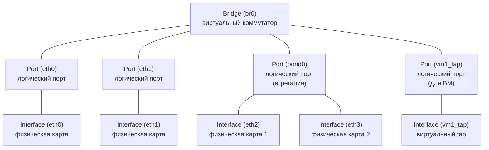

Open vSwitch — это **программный коммутатор** с открытым исходным кодом, который реализует функциональность L2-коммутатора в среде виртуализации и облачных инфраструктур. В отличие от физических коммутаторов, OVS работает внутри хоста (сервера) и позволяет создавать виртуальные сети, VLAN, агрегацию каналов и интегрироваться с системами оркестрации (Kubernetes, OpenStack) через протокол OpenFlow.

## Установка и базовые команды

### Установка (Debian/Ubuntu)

```bash
sudo apt update
sudo apt install openvswitch-switch
```

### Три главные утилиты

| Утилита      | Для чего                                |
| ------------ | --------------------------------------- |
| `ovs-vsctl`  | Настройка мостов, портов, VLAN          |
| `ovs-ofctl`  | Работа с таблицами OpenFlow             |
| `ovs-appctl` | Управление демоном, статистика, отладка |

> [!note] Важно  
> В 90% случаев нужен только `ovs-vsctl`
> Для сложных SDN-сценариев `ovs-ofctl`
> Для отладки `ovs-appctl`.

## Архитектура OVS: Bridge, Port, Interface

Это самая важная концепция, которую нужно понять. В OVS иерархия объектов отличается от физических коммутаторов.



### Bridge (мост)

Это **сам коммутатор**. Аналог физического коммутатора. У моста есть имя (например, `br0`, `br-int`, `br-ex`). К мосту подключаются порты. Мосту можно назначить IP-адрес — но не напрямую, а через **internal port** с тем же именем (об этом ниже).

### Port (порт)

Это **логический порт** коммутатора. К одному порту может быть привязан один или несколько интерфейсов. Именно на порте настраиваются VLAN-параметры (access/trunk), LACP, STP.

### Interface (интерфейс)

Это **конкретный сетевой интерфейс**, который "входит" в порт. Это может быть:

- Физический интерфейс (`eth0`, `ens192`).
- Внутренний интерфейс (`internal`) — для назначения IP мосту.
- Туннельный интерфейс (`vxlan0`, `gre0`).

> [!important] Ключевое правило  
> **VLAN настраивается на порту, а не на интерфейсе.** Если порт — это bond из двух физических интерфейсов, VLAN применяется ко всему bond'у целиком.

### Internal Port — как назначить IP мосту

В физическом коммутаторе можно назначить IP-адрес на VLAN-интерфейс (SVI). В OVS мост сам по себе IP не имеет. Чтобы мост стал "маршрутизируемым", создаётся **internal port** с тем же именем, что и мост.

```
Bridge: br0
├── Port: br0 (internal) ← здесь живёт IP-адрес
├── Port: eth0
└── Port: eth1
```

После создания internal port в системе появляется сетевой интерфейс `br0` (обычный Linux-интерфейс), которому можно назначить IP через `ip addr` или сетевой менеджер.

