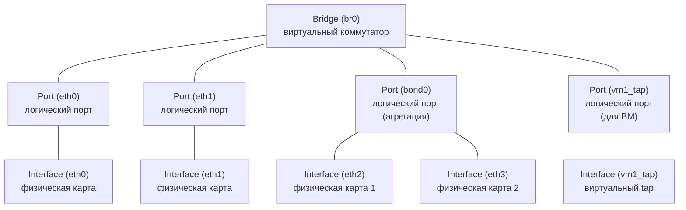

Open vSwitch — это **программный коммутатор** с открытым исходным кодом, который реализует функциональность L2-коммутатора в среде виртуализации и облачных инфраструктур. В отличие от физических коммутаторов, OVS работает внутри хоста (сервера) и позволяет создавать виртуальные сети, VLAN, агрегацию каналов и интегрироваться с системами оркестрации (Kubernetes, OpenStack) через протокол OpenFlow.

## Установка и базовые команды

### Установка (Debian/Ubuntu)

```bash
sudo apt update
sudo apt install openvswitch-switch
```

### Три главные утилиты

| Утилита      | Для чего                                |
| ------------ | --------------------------------------- |
| `ovs-vsctl`  | Настройка мостов, портов, VLAN          |
| `ovs-ofctl`  | Работа с таблицами OpenFlow             |
| `ovs-appctl` | Управление демоном, статистика, отладка |

> [!note] Важно  
> В 90% случаев нужен только `ovs-vsctl`
> Для сложных SDN-сценариев `ovs-ofctl`
> Для отладки `ovs-appctl`.

## Архитектура OVS: Bridge, Port, Interface

Это самая важная концепция, которую нужно понять. В OVS иерархия объектов отличается от физических коммутаторов.



- **Bridge** — это виртуальный коммутатор. Аналог физического коммутатора в стойке. У него есть имя (например, `br0`, `br-int`, `br-ex`).
- **Port** — это **логический** порт коммутатора. Один порт может содержать **один или несколько интерфейсов**.
- **Interface** — это конкретный сетевой интерфейс (физическая карта `eth0`, виртуальный `tap0`, `veth`, тунельный интерфейс `vxlan0`, `gre0`).

>[!important] Ключевое отличие от физического мира  
В физическом коммутаторе "порт" = "интерфейс" (один разъём = один порт). В OVS **порт — это контейнер для интерфейсов**. Это нужно для агрегации: один порт `bond0` может содержать два интерфейса `eth0` и `eth1`.


### Пример: как это выглядит на практике

Создаем мост `br0` и добавляем в него `eth0`:

```bash
ovs-vsctl add-br br0
ovs-vsctl add-port br0 eth0
```

Что произошло:

1. Создан **Bridge** `br0` (виртуальный коммутатор).
2. Создан **Port** `eth0` (логический порт с тем же именем).
3. В этот порт добавлен **Interface** `eth0` (физическая карта).

Проверяем:

```bash
ovs-vsctl show
```

Вывод:

```bash
Bridge "br0"
    Port "eth0"
        Interface "eth0"
    Port "br0"
        Interface "br0"
            type: internal
```

>[!note] Обрати внимание  
Появился второй порт `br0` с интерфейсом `br0` типа `internal`. Это **внутренний интерфейс** моста — он нужен, чтобы сам хост (Linux) мог иметь IP-адрес на этом мосте. Об этом ниже.

## Создание моста и добавление портов

### Базовые команды

```bash
# Создать мост
ovs-vsctl add-br br0

# Добавить физический порт в мост
ovs-vsctl add-port br0 eth0

# Посмотреть конфигурацию
ovs-vsctl show

# Удалить порт
ovs-vsctl del-port br0 eth0

# Удалить мост (вместе со всеми портами)
ovs-vsctl del-br br0
```

### Важный нюанс: IP-адреса

Когда ты добавляешь физическую карту `eth0` в OVS-мост, она **теряет свой IP-адрес** (если был). Теперь IP-адрес должен быть на **внутреннем интерфейсе моста** `br0`.

## VLAN в OVS: Access и Trunk

В OVS VLAN настраиваются через параметры **порта**, а не интерфейса.

### Access Port (порт доступа)

Access-порт принадлежит **одному VLAN**. Все кадры, приходящие на этот порт, автоматически помечаются этим VLAN. Все кадры, уходящие с этого порта, теги снимаются.

**Пример:** ВМ подключена к порту `vnet0`, и мы хотим, чтобы она была в VLAN 10.

```bash
# Создаём мост
ovs-vsctl add-br br0

# Добавляем порт для ВМ и указываем VLAN tag
ovs-vsctl add-port br0 ens18 tag=10
```

Проверяем:

```bash
ovs-vsctl show
```

Вывод:

```bash
Bridge "br0"
    Port "ens18"
        tag: 10
        Interface "ens18"
```

>[!note] Что произошло  
Теперь все кадры, приходящие с `ens18` (от ВМ), будут внутренне помечены как VLAN 10. Все кадры, уходящие на `ens18`, будут отправлены **без тега** (untagged), чтобы ВМ их поняла.

### Trunk Port (магистральный порт)

Trunk-порт передаёт трафик **нескольких VLAN**. В OVS это делается через параметр `trunks`.

**Пример:** Сервер с виртуализацией подключён к порту `eth1`, и мы хотим, чтобы через него проходили VLAN 10, 20, 30.

```bash
# Добавляем порт и указываем список VLAN
ovs-vsctl add-port br0 eth1 trunks=10,20,30
```

Проверяем:

```bash
ovs-vsctl show
```

Вывод:

```bash
Bridge "br0"
    Port "eth1"
        trunks: [10, 20, 30]
        Interface "eth1"
```

>[!note] Что произошло  
Теперь через `eth1` могут проходить кадры с тегами VLAN 10, 20, 30. Все остальные VLAN будут отброшены.

### Native VLAN (родной VLAN)

Если нужно, чтобы какой-то VLAN передавался **без тега** (как Native VLAN в физическом коммутаторе), используется параметр `vlan-mode`.

```bash
ovs-vsctl set port eth1 vlan_mode=native-untagged
ovs-vsctl set port eth1 tag=10
ovs-vsctl set port eth1 trunks=10,20,30
```

Теперь пакеты VLAN 10 идущие от нашей sw-вм будут отсылаться не тегированными, а остальные тегированными

## Bond (агрегация каналов) в OVS

OVS поддерживает агрегацию каналов, и делает это **на уровне портов**. Один порт может содержать несколько интерфейсов.

#### Типы bond в OVS

|Тип|Описание|Аналог в физическом мире|
|---|---|---|
|`active-backup`|Один интерфейс активен, другой в резерве. При отказе — переключение.|Cisco EtherChannel static (без LACP)|
|`balance-slb`|Балансировка по хешу Src MAC/Dst MAC. Без LACP.|Статическая агрегация|
|`balance-tcp`|Балансировка по хешу L2+L3+L4 (MAC, IP, порты). **Требует LACP** на другой стороне.|LACP (802.3ad)|

#### Пример: Active-Backup (простой failover)

У тебя две физические карты `eth0` и `eth1`. Хочешь, чтобы одна работала, а вторая была в резерве.

```bash
# Создаём мост
ovs-vsctl add-br br0

# Создаём bond с двумя интерфейсами
ovs-vsctl add-bond br0 bond0 eth0 eth1 bond_mode=active-backup
```

Проверяем:

```bash
ovs-vsctl show
```

Вывод:

```bash
Bridge "br0"
    Port "bond0"
        Interface "eth0"
        Interface "eth1"
```

>[!note] Что произошло  
Создан один порт `bond0`, в который добавлены два интерфейса `eth0` и `eth1`. OVS будет использовать `eth0`, а если он упадёт — переключится на `eth1`.

### Пример: Balance-TCP (LACP)

Это самый распространённый вариант для серверов. Требует, чтобы на физическом коммутаторе был настроен LACP.

```bash
# Создаём bond с LACP
ovs-vsctl add-bond br0 bond0 eth0 eth1 \
    bond_mode=balance-tcp \
    lacp=active
```

Проверяем:

```bash
ovs-vsctl show
```

Вывод:

```bash
Bridge "br0"
    Port "bond0"
        lacp: active
        Interface "eth0"
        Interface "eth1"
```

>[!important] Важно  
Параметр `lacp=active` говорит OVS активно отправлять LACPDU. На физическом коммутаторе тоже должен быть настроен LACP (Active или Passive). Если на коммутаторе LACP не настроен, bond не поднимется.

### Параметры bond

| Параметр                      | Значение                                      | Описание                                          |
| ----------------------------- | --------------------------------------------- | ------------------------------------------------- |
| `bond_mode`                   | `active-backup`, `balance-slb`, `balance-tcp` | Тип агрегации                                     |
| `lacp`                        | `active`, `passive`, `off`                    | Режим LACP (только для `balance-tcp`)             |
| `other_config:bond_updelay`   | миллисекунды                                  | Задержка перед активацией порта после link-up     |
| `other_config:bond_downdelay` | миллисекунды                                  | Задержка перед деактивацией порта после link-down |

#### Пример с настройкой задержек:

```bash
ovs-vsctl add-bond br0 bond0 eth0 eth1 \
    bond_mode=balance-tcp \
    lacp=active \
    other_config:bond_updelay=1000 \
    other_config:bond_downdelay=500
```

## STP в OVS

OVS поддерживает STP, но с **важными ограничениями**.

#### Что поддерживается

- Классический STP (IEEE 802.1D).
- Выбор Root Bridge, Root Port, Designated Port.
- Блокировка портов при петлях.

#### Что НЕ поддерживается

- **RSTP (Rapid STP, 802.1w)** — только классический медленный STP.
- **MSTP (802.1s)** — нет.
- **PortFast / Edge Port** — нет прямого аналога.

### Включение STP

```bash
# Включаем STP на мосту
ovs-vsctl set bridge br0 stp_enable=true

# Устанавливаем приоритет моста (для выбора Root Bridge)
ovs-vsctl set bridge br0 other_config:stp-priority=4096

# Устанавливаем стоимость пути для конкретного порта
ovs-vsctl set port eth0 other_config:stp-path-cost=10
```

>[!warning] Ограничения  
STP в OVS работает медленно (30-50 секунд на сходимость), как классический 802.1D. В современных сетях это неприемлемо. Поэтому в продакшене OVS обычно используют **вместе с физическими коммутаторами, где включён RSTP**, а на самом OVS STP либо выключен, либо используется только для базовой защиты от петель.

#### Best Practice

В реальных сетях с OVS:

1. На физическом коммутаторе включён **RSTP**.
2. На OVS STP **выключен** (по умолчанию).
3. Защита от петель обеспечивается тем, что OVS-хост подключён к коммутатору через **access-порты** или **bond с active-backup**, где петель быть не может.

## Внутренние интерфейсы (Internal Ports)

Когда ты создаёшь мост `br0`, OVS автоматически создаёт **внутренний интерфейс** с тем же именем `br0`. Это нужно, чтобы сам хост (Linux) мог иметь IP-адрес на этом мосте.

### Зачем это нужно

Представь: у тебя есть мост `br0`, к которому подключены ВМ. Ты хочешь, чтобы хост тоже мог общаться с этими ВМ (например, для подключения через ssh, мониторинга). Для этого нужен IP-адрес на мосту.

```bash
# Создаём мост
ovs-vsctl add-br br0

# Назначаем IP на внутренний интерфейс
sudo ip addr add 192.168.1.10/24 dev br0
sudo ip link set br0 up
```

Теперь хост может пинговать ВМ в этом мосте.

### Дополнительные внутренние интерфейсы

Ты можешь создать **дополнительные** внутренние интерфейсы для разных VLAN.

**Пример:** Хосту нужен IP в VLAN 10 и VLAN 20.

```bash
# Создаём мост
ovs-vsctl add-br br0

# Создаём внутренние интерфейсы для VLAN
ovs-vsctl add-port br0 vlan10 tag=10 -- set interface vlan10 type=internal
ovs-vsctl add-port br0 vlan20 tag=20 -- set interface vlan20 type=internal

# Назначаем IP
sudo ip addr add 10.0.10.1/24 dev vlan10
sudo ip addr add 10.0.20.1/24 dev vlan20
sudo ip link set vlan10 up
sudo ip link set vlan20 up
```

>[!note] Что произошло  
Созданы два дополнительных внутренних интерфейса `vlan10` и `vlan20`, каждый со своим VLAN tag. Теперь хост имеет IP-адреса в обоих VLAN.

## Сохранение конфигурации

OVS сохраняет свою конфигурацию в базе данных (`/etc/openvswitch/conf.db`), поэтому после перезагрузки мосты и порты восстановятся автоматически.

Но IP-адреса и маршруты нужно сохранять через стандартные механизмы Linux:

- **Debian/Ubuntu:** `/etc/network/interfaces`
- **RHEL/CentOS:** `/etc/sysconfig/network-scripts/`
- **Systemd-networkd:** `/etc/systemd/network/`
- **NetworkManager:** `nmcli`