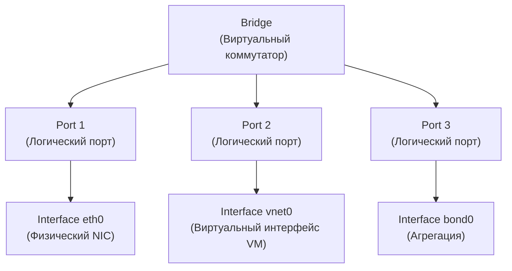

Open vSwitch — это **программный коммутатор** с открытым исходным кодом, который реализует функциональность L2-коммутатора в среде виртуализации и облачных инфраструктур. В отличие от физических коммутаторов, OVS работает внутри хоста (сервера) и позволяет создавать виртуальные сети, VLAN, агрегацию каналов и интегрироваться с системами оркестрации (Kubernetes, OpenStack) через протокол OpenFlow.

### Архитектура OVS: Bridge, Port, Interface

Это самая важная концепция, которую нужно понять. В OVS иерархия объектов отличается от физических коммутаторов.

### Bridge (мост)

**Bridge** — это виртуальный коммутатор. Аналог физического коммутатора. У него есть:

- Имя (например, `br0`, `br-int`, `br-ex`).
- Таблица MAC-адресов.
- Логика коммутации (L2 forwarding).
- Опционально: IP-адрес (если это L3-мост).

**Пример:** `br-int` — внутренний мост для виртуальных машин, `br-ex` — внешний мост для связи с физической сетью.

### Port (порт)

**Port** — это **логическая точка подключения** к мосту. Это НЕ физический порт, как на коммутаторе. Port — это абстракция, которая может содержать один или несколько Interface.

**Важно:** В OVS Port — это не то же самое, что физический порт на коммутаторе. Port в OVS — это скорее "группа интерфейсов" или "логическое подключение".

**Примеры:**

- Port с одним Interface: подключение физического NIC `eth0`.
- Port с несколькими Interface: bond (агрегация) из `eth0` и `eth1`.
- Port с internal Interface: виртуальный интерфейс для IP-адреса моста.

### Interface (интерфейс)

**Interface** — это конкретный сетевой интерфейс, который подключен к Port-у. Это может быть:

- Физический NIC (`eth0`, `ens192`).
- Виртуальный интерфейс (`vnet0`, `tap0`).
- Internal Interface (виртуальный интерфейс самого моста).
- Туннельный интерфейс (`vxlan0`, `gre0`).

> [!important] Ключевое отличие от физического коммутатора  
> На физическом коммутаторе "порт" — это физический разъём. В OVS "Port" — это логическая абстракция, которая может объединять несколько физических интерфейсов (bond) или быть точкой подключения для виртуального интерфейса.