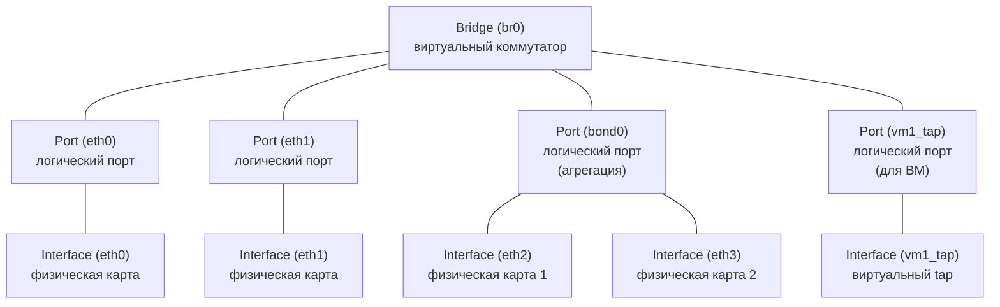

Open vSwitch — это **программный коммутатор** с открытым исходным кодом, который реализует функциональность L2-коммутатора в среде виртуализации и облачных инфраструктур. В отличие от физических коммутаторов, OVS работает внутри хоста (сервера) и позволяет создавать виртуальные сети, VLAN, агрегацию каналов и интегрироваться с системами оркестрации (Kubernetes, OpenStack) через протокол OpenFlow.

## Установка и базовые команды

### Установка (Debian/Ubuntu)

```bash
sudo apt update
sudo apt install openvswitch-switch
```

### Три главные утилиты

| Утилита      | Для чего                                |
| ------------ | --------------------------------------- |
| `ovs-vsctl`  | Настройка мостов, портов, VLAN          |
| `ovs-ofctl`  | Работа с таблицами OpenFlow             |
| `ovs-appctl` | Управление демоном, статистика, отладка |

> [!note] Важно  
> В 90% случаев нужен только `ovs-vsctl`
> Для сложных SDN-сценариев `ovs-ofctl`
> Для отладки `ovs-appctl`.

## Архитектура OVS: Bridge, Port, Interface

Это самая важная концепция, которую нужно понять. В OVS иерархия объектов отличается от физических коммутаторов.



- **Bridge** — это виртуальный коммутатор. Аналог физического коммутатора в стойке. У него есть имя (например, `br0`, `br-int`, `br-ex`).
- **Port** — это **логический** порт коммутатора. Один порт может содержать **один или несколько интерфейсов**.
- **Interface** — это конкретный сетевой интерфейс (физическая карта `eth0`, виртуальный `tap0`, `veth`, тунельный интерфейс `vxlan0`, `gre0`).

>[!important] Ключевое отличие от физического мира  
В физическом коммутаторе "порт" = "интерфейс" (один разъём = один порт). В OVS **порт — это контейнер для интерфейсов**. Это нужно для агрегации: один порт `bond0` может содержать два интерфейса `eth0` и `eth1`.


### Пример: как это выглядит на практике

Создаем мост `br0` и добавляем в него `eth0`:

```bash
ovs-vsctl add-br br0
ovs-vsctl add-port br0 eth0
```

Что произошло:

1. Создан **Bridge** `br0` (виртуальный коммутатор).
2. Создан **Port** `eth0` (логический порт с тем же именем).
3. В этот порт добавлен **Interface** `eth0` (физическая карта).

Проверяем:

```bash
ovs-vsctl show
```

Вывод:

```bash
Bridge "br0"
    Port "eth0"
        Interface "eth0"
    Port "br0"
        Interface "br0"
            type: internal
```

